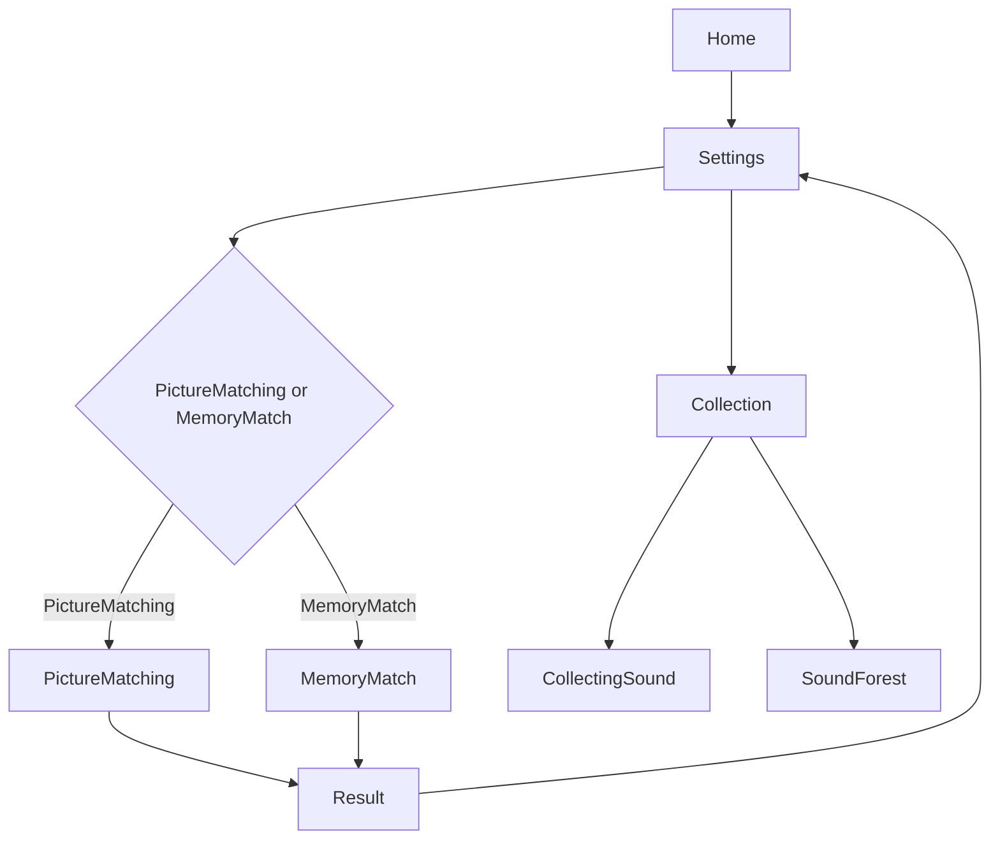

# ゲーム構成案

## 対象ゲーム
- 音の絵合わせ
- 音の神経衰弱

---

## 1. シーン構成

```
Scenes/
├── Home.unity                    # メインメニュー
├── Settings.unity                # 設定画面（ゲーム選択・難易度選択）
├── Collection.unity              # 音コレクション画面
├── CollectingSound.unity         # 録音・音加工画面
├── SoundForest.unity             # サウンドフォレスト（他ユーザーの音ダウンロード）
├── Games/
│   ├── PictureMatching.unity     # 音の絵合わせ
│   └── MemoryMatch.unity         # 音の神経衰弱
└── Result.unity                  # 結果画面
```

### シーン遷移図



---

## 2. データ構造

### 2.1 ゲーム設定データ (ScriptableObject)

```csharp
// filepath: Assets/Scripts/GameData/GameSettings.cs
[CreateAssetMenu(fileName = "GameSettings", menuName = "Game/Settings")]
public class GameSettings : ScriptableObject
{
    [Header("=== 音の絵合わせ ===")]
    [Range(2, 6)] public int defaultChoiceCount = 4;
    [Range(3, 10)] public int defaultQuestionCount = 5;
    
    [Header("時間制限（秒）")]
    public int easyTimeLimit = 20;
    public int normalTimeLimit = 15;
    public int hardTimeLimit = 10;
    
    [Header("不正解許容")]
    public int maxWrongAnswers = 3;
    
    [Header("=== 音の神経衰弱 ===")]
    [Range(3, 5)] public int defaultSetCount = 3;
    [Range(1, 5)] public int defaultRounds = 3;
}
```

### 2.2 解放条件データ (ScriptableObject)

```csharp
// filepath: Assets/Scripts/GameData/UnlockSettings.cs
[CreateAssetMenu(fileName = "UnlockSettings", menuName = "Game/Unlock Settings")]
public class UnlockSettings : ScriptableObject
{
    [Header("音の神経衰弱 解放条件")]
    public int pictureMatchingClearsRequired = 7;
    public bool useTimeBasedUnlock = false;
    public float averageTimeThreshold = 10f;
    
    [Header("音の並べ替え（ジグザグ） 解放条件")]
    public int sortLowClearsRequired = 1;
    
    [Header("音の迷路 解放条件")]
    public int memoryAndZigzagClearsRequired = 1;
    
    [Header("音の錬金術 解放条件")]
    public int cookingClearsRequired = 5;
}
```

### 2.3 セーブデータ (JSON)

```json
// filepath: Assets/Scripts/SaveData/UserSaveData.cs
[System.Serializable]
public class UserSaveData
{
    public PlayerProgress progress = new PlayerProgress();
    public PlayHistory history = new PlayHistory();
    public CollectionData collection = new CollectionData();
}

[System.Serializable]
public class PlayerProgress
{
    public Dictionary<string, int> gameClearCounts = new Dictionary<string, int>();  // ゲームID -> クリア回数
    public Dictionary<string, bool> unlockedGames = new Dictionary<string, bool>();  // ゲームID -> 解放済みか
    public Dictionary<string, float> averageTimes = new Dictionary<string, float>(); // ゲームID -> 平均回答時間
}

[System.Serializable]
public class PlayHistory
{
    public List<PlayRecord> records = new List<PlayRecord>();
}

[System.Serializable]
public class PlayRecord
{
    public string gameId;
    public string difficulty;
    public int score;
    public float playTime;
    public int correctAnswers;
    public int wrongAnswers;
    public DateTime playedAt;
}
```

---

## 3. スクリプト構成

### 3.1 マネージャー類

| スクリプト | 役割 |
|-----------|------|
| `GameManager` | ゲーム全体の制御（Singleton） |
| `SaveManager` | セーブ・ロード処理 |
| `SoundManager` | 音再生・ピッチ変調管理 |
| `DifficultyManager` | AI難易度判定・調整 |
| `UnlockManager` | ゲーム解放判定 |

### 3.2 音の絵合わせ

| スクリプト | 役割 |
|-----------|------|
| `PictureMatchingGame` | ゲームロジック管理 |
| `PictureMatchingQuestion` | 問題生成・回答判定 |
| `ChickenController` | 鶏（参考音）のタップ制御 |
| `ChickController` | ひよこ（選択肢）のタップ制御 |
| `DragDropAnswer` | ドラッグ＆ドロップ回答処理 |
| `TimerController` | 時間制限管理 |

### 3.3 音の神経衰弱

| スクリプト | 役割 |
|-----------|------|
| `MemoryMatchGame` | ゲームロジック管理 |
| `MemoryMatchCard` | カードの状態管理・めくり |
| `MemoryMatchDeck` | デッキ生成・シャッフル |
| `ComputerAI` | コンピューター対戦用AI |

### 3.4 共通UI

| スクリプト | 役割 |
|-----------|------|
| `GameSelector` | ゲーム選択UI |
| `DifficultySelector` | 難易度選択UI |
| `SoundSelector` | 音選択UI |
| `ResultScreen` | 結果表示 |

---

## 4. UI構成

### 4.1 設定画面 (Settings.unity)

```
Canvas
├── Header (タイトル)
├── GameTypePanel
│   ├── PictureMatchingButton (音の絵合わせ)
│   ├── MemoryMatchButton (音の神経衰弱)
│   └── [他のゲームボタン...]
├── DifficultyPanel (ゲーム選択後に表示)
│   ├── EasyButton
│   ├── NormalButton
│   ├── HardButton
│   └── AutoButton (AI自動判定)
├── SoundSelectionPanel (ゲーム選択後に表示)
│   ├── SoundTypeToggle (音色 / 音高)
│   ├── SoundListView (利用可能な音リスト)
│   └── RandomToggle (コンピューター選択)
├── GameOptionsPanel (ゲーム固有オプション)
│   ├── PictureMatching: ChoiceCountSlider, QuestionCountSlider
│   └── MemoryMatch: SetCountSlider
└── StartButton
```

### 4.2 音の絵合わせ画面 (PictureMatching.unity)

```
Canvas
├── QuestionPanel
│   ├── ReferenceSoundArea
│   │   └── ChickenSprite (タップで参考音を再生)
│   └── TimerBar
├── AnswerPanel
│   ├── DropZone (正解をドロップする場所)
│   └── FeedbackText (正解/不正解表示)
├── ChoicePanel
│   ├── ChickSprite x N (タップで音を再生、ドラッグで回答)
│   └── WrongAnswerCounter (残り回数表示)
└── PauseButton
```

### 4.3 音の神経衰弱画面 (MemoryMatch.unity)

```
Canvas
├── GameInfoPanel
│   ├── RoundIndicator (ラウンド表示)
│   ├── ScoreDisplay (スコア)
│   └── TurnIndicator (手番表示)
├── CardGrid
│   └── CardPrefab x 6-10 (タップでめくり)
│       ├── BackSprite (裏面)
│       └── FrontSprite (表面 - 音アイコン)
├── ModePanel
│   ├── SinglePlayButton
│   └── VSComputerButton
└── PauseButton
```

---

## 5. 音データ管理

### 5.1 音コレクション

```csharp
// filepath: Assets/Scripts/Audio/SoundData.cs
[System.Serializable]
public class SoundData
{
    public string id;
    public string displayName;
    public AudioClip originalClip;
    public SoundCategory category;  // 楽器、自然音など
    public bool isPitchModulated;   // ピッチ変調済みか
}

public enum SoundCategory
{
    Instrument,
    Nature,
    Ambient,
    Effect,
    Voice
}
```

### 5.2 ピッチ変調管理

```csharp
// filepath: Assets/Scripts/Audio/PitchModulator.cs
public class PitchModulator : MonoBehaviour
{
    [Header("難易度別ピッチ変調率")]
    public float easyPitchVariance = 0.5f;   // ±50% (大きな差)
    public float normalPitchVariance = 0.2f; // ±20% (中程度の差)
    public float hardPitchVariance = 0.05f;  // ±5% (微分音程)
    
    public AudioClip ModulatePitch(AudioClip original, float variance)
    {
        // ピッチ変調の実装
    }
}
```

---

## 6. 解放システム

```csharp
// filepath: Assets/Scripts/System/UnlockManager.cs
public class UnlockManager : MonoBehaviour
{
    public static UnlockManager Instance { get; private set; }
    
    [SerializeField] private UnlockSettings unlockSettings;
    
    public bool IsGameUnlocked(string gameId)
    {
        var saveData = SaveManager.Load();
        return saveData.progress.unlockedGames.GetValueOrDefault(gameId, false);
    }
    
    public void CheckAndUnlock(string gameId)
    {
        var saveData = SaveManager.Load();
        
        switch (gameId)
        {
            case "MemoryMatch":
                // 音の絵合わせ7回クリアで解放
                int clears = saveData.progress.gameClearCounts.GetValueOrDefault("PictureMatching", 0);
                if (clears >= unlockSettings.pictureMatchingClearsRequired)
                {
                    saveData.progress.unlockedGames["MemoryMatch"] = true;
                }
                break;
            // 他のゲームの解放判定...
        }
        
        SaveManager.Save(saveData);
    }
}
```

---

## 7. AI難易度判定

```csharp
// filepath: Assets/Scripts/System/DifficultyManager.cs
public class DifficultyManager : MonoBehaviour
{
    public static DifficultyManager Instance { get; private set; }
    
    [SerializeField] private GameSettings gameSettings;
    
    public DifficultyLevel CalculateAutoDifficulty(string gameId)
    {
        var saveData = SaveManager.Load();
        var history = saveData.history.records
            .Where(r => r.gameId == gameId)
            .OrderByDescending(r => r.playedAt)
            .Take(10)  // 直近10回のデータを参照
            .ToList();
        
        if (history.Count == 0)
            return DifficultyLevel.Easy;
        
        float avgCorrectRate = history.Average(r => (float)r.correctAnswers / (r.correctAnswers + r.wrongAnswers));
        float avgTime = history.Average(r => r.playTime);
        
        // 判定ロジック
        if (avgCorrectRate > 0.9f && avgTime < gameSettings.easyTimeLimit * 0.5f)
            return DifficultyLevel.Hard;
        else if (avgCorrectRate > 0.7f)
            return DifficultyLevel.Normal;
        else
            return DifficultyLevel.Easy;
    }
    
    public float GetPitchVariance(DifficultyLevel difficulty)
    {
        return difficulty switch
        {
            DifficultyLevel.Easy => 0.5f,
            DifficultyLevel.Normal => 0.2f,
            DifficultyLevel.Hard => 0.05f,
            _ => 0.2f
        };
    }
}

public enum DifficultyLevel
{
    Easy,
    Normal,
    Hard,
    Auto
}
```

---

## 8. 実装優先順位

| 優先度 | 内容 |
|-------|------|
| 1 | ベースシステム（SaveManager, GameManager） |
| 2 | 設定画面（Settings） |
| 3 | 音の絵合わせゲーム |
| 4 | 音の神経衰弱ゲーム |
| 5 | 解放システム |
| 6 | AI難易度判定 |
| 7 | 結果画面 |

---

## 9. プレハブ構成

### 9.1 音の絵合わせ用プレハブ

```
Prefabs/
├── Games/
│   └── PictureMatching/
│       ├── Chicken (参考音再生用)
│       │   ├── ChickenSprite.png
│       │   └── ChickenController.cs
│       ├── Chick (選択肢)
│       │   ├── ChickSprite.png
│       │   ├── ChickController.cs
│       │   └── DragDropComponent.cs
│       ├── DropZone
│       │   └── DropZone.cs
│       └── TimerBar
│           └── TimerController.cs
```

### 9.2 音の神経衰弱用プレハブ

```
Prefabs/
└── Games/
    └── MemoryMatch/
        ├── Card
        │   ├── CardBackSprite.png
        │   ├── CardFrontSprite.png
        │   └── MemoryMatchCard.cs
        └── CardGrid (レイアウトグループ)
```

---

## 10. 次のステップ

1. **ベースシステム作成**
   - SaveManager
   - GameSettings (ScriptableObject)
   - UnlockSettings (ScriptableObject)

2. **設定画面作成**
   - Settings.unity
   - GameSelector, DifficultySelector, SoundSelector

3. **音の絵合わせ実装**
   - PictureMatching.unity
   - ゲームロジックスクリプト

4. **音の神経衰弱実装**
   - MemoryMatch.unity
   - ゲームロジックスクリプト

---

ご質問や追加したい機能があればお知らせください。