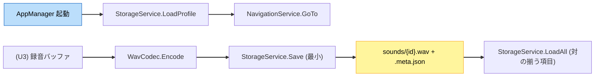

# U1 基盤 — Business Logic Model（振る舞い・データフロー）

**ユニット**: U1 基盤
**作成**: 2026-07-15 / AI-DLC CONSTRUCTION / Functional Design（Part 2）
**対象**: サービス器（AppManager/NavigationService/StorageService最小/AudioService器/ContentService器）＋純粋関数（WavCodec/PitchMath）の業務ロジック。

> 技術非依存の「何をするか」を定義。Unity/実装依存（AudioFilter、Prefab 具体、シリアライザ選定）は Code Generation で確定。

---

## 1. 起動フロー（AppManager）
入力: なし / 出力: 最初の画面遷移
1. サービス初期化（Storage/Navigation/Audio/Content の器を用意）。
2. `profile = StorageService.LoadProfile()`。
3. `profile == null`（初回）→ `NavigationService.GoTo(Main)` → 登録フロー（Home 内）→ 登録完了で `GoTo(Home)`。
4. `profile != null` → `GoTo(Main)` → `GoTo(Home)`。
- 例外: 初期化中の失敗は致命/非致命を判定（BR-18）。非致命は警告のうえ継続（BR-19）。

## 2. ナビゲーション解決（NavigationService）
入力: `SceneId target` / 出力: 画面遷移
- `SceneId` → 実シーン/パネルへの解決表を内部に持つ（文字列直指定を排除、BR-12）。
- `Place` は解決表に存在しない（BR-13）。未定義要求は無視＋警告（BR-15）。
- `GoHome()` / `GoBack()` を提供。

## 3. 永続化（StorageService 最小 / U4 で強化）
### 3.1 SaveProfile(profile)
- 検証（BR-01/02）通過後 `profile.json` に保存。
### 3.2 LoadProfile()
- `profile.json` を読込。無ければ null。破損時は null＋警告（BR-19）。
### 3.3 Save(savedSound)（最小）
- `sounds/{id}.wav` と `sounds/{id}.meta.json` を書き出し（対で）。原子的置換は U4（BR-06）。
### 3.4 LoadAll()（最小）
- `sounds/` を走査し、wav/meta の**対が揃う項目のみ**を返す。欠損/破損は読み飛ばし＋件数警告（BR-05/19）。
### 3.5 Delete(id)
- 対応する wav/meta を削除。

## 4. WAV エンコード/デコード（WavCodec / 純粋関数・PBT）
- `Encode(AudioBuffer) -> bytes`: ヘッダ（44100/mono/16bit）＋ PCM(16bit) 化。float[-1,1]→int16 量子化。
- `Decode(bytes) -> AudioBuffer`: ヘッダ解析→ int16→float 復元。
- 不変条件（BR-10）: ラウンドトリップでサンプル数一致・値は量子化誤差内。
- 異常系: 不正ヘッダ/長さは `Decode` で失敗を返す（例外を握り潰さない）。

## 5. ピッチ数学（PitchMath / 純粋関数・PBT）
- `CentsToRatio(cents) = 2^(cents/1200)`、`SemitonesToRatio(n) = 2^(n/12)`。
- `RatioToCents(ratio) = 1200 * log2(ratio)`。
- クランプ: `pitchSemitones ∈ [-12, +12]`（BR-11）。
- 不変条件（BR-11）: 逆変換の往復一致（許容誤差内）。

## 6. コンテンツ取得（ContentService 器）
- `GetUITheme()` / `GetThemeCatalog()` / `GetSoundMatchConfig()` の**器（IF）**を U1 で定義。
- 実データ（ThemeCatalog/SoundMatchConfig/UITheme の中身）は各ユニット（U4/U5/U6）で ScriptableObject として用意。
- 目的: Sさん のコード非依存な差し替え（US-TECH-07）。

## 7. データフロー（U1 の器が関わる範囲）

### テキスト代替
1. AppManager 起動 → LoadProfile → 初期遷移（GoTo）。
2. （U3 の）録音バッファ → WavCodec.Encode → StorageService.Save(最小) → ファイル対を保存。
3. LoadAll は wav/meta の対が揃う項目のみ返す（欠損は読み飛ばし＋警告）。

## トレース
起動/遷移→US-NAV/US-TECH-04 ／ 永続化→US-COL-04/US-TECH-06（U4強化）／ WavCodec/PitchMath→US-REC/US-GAME1/NFR-09 ／ ContentService→US-TECH-07。
