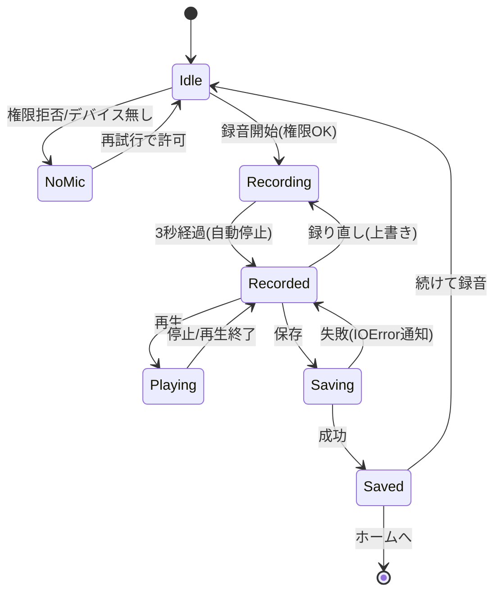

# U3 Rec — Business Logic Model（業務ロジック・ふるまい）

**ユニット**: U3 Rec（録音・加工・保存）
**作成**: 2026-07-15 / AI-DLC CONSTRUCTION / Functional Design（Part 2）
**決定**: Q1〜Q7＝すべて A（推奨）
**対応**: US-REC-01/02/03, US-TECH-03 / FR-05〜08 / NFR-03/06/08 / SECURITY-15

> 本書は**技術非依存のふるまい／データフロー**を定義する。DSP のリアルタイム反映方式・具体フィルタ値・スレッド/コルーチン設計は NFR Design / Code Generation で扱う。

---

## 1. 概要（ハイレベル・フロー）

```
[Rec 画面表示] → マイク権限確認
     │
     ├─ 不可（Denied/NoDevice） → 案内表示・録音無効（クラッシュしない）
     │
     └─ 可（Granted）
           → [録音]（3秒・自動停止） → AudioBuffer 生成
                 → [加工プレビュー]（ピッチ/ノイズ/音色/リバーブ＋バイパス, 再生で確認）
                       → [保存]（任意タイトル → 生WAV＋設定を対で永続化）
                             → 完了通知 → ホームへ / 続けて録り直し
```

- **非破壊**（Q3=A）: 保存する WAV は生録音。加工は `SoundEffectSettingsData` として対で保存し、再生時に再適用。
- **すべての失敗は `Result` で返し、クラッシュしない**（SECURITY-15）。

---

## 2. 録音状態マシン（RecordingState）

### 2.1 状態遷移図（Mermaid）


### 2.2 状態遷移表（テキスト代替）

| 現状態 | イベント | 次状態 | 補足 |
|---|---|---|---|
| Idle | 権限拒否/デバイス無し | NoMic | 案内表示・録音ボタン無効 |
| NoMic | 再試行→許可 | Idle | 録音可能に復帰 |
| Idle | 録音開始（権限OK） | Recording | 3秒カウントダウン開始 |
| Recording | 3秒経過 | Recorded | 自動停止・AudioBuffer 確定・`hasUnsavedRecording=true` |
| Recorded | 再生 | Playing | 現在の設定で加工再適用 |
| Playing | 停止/再生終了 | Recorded | |
| Recorded | 録り直し | Recording | 既存 buffer は破棄し上書き |
| Recorded | 保存 | Saving | タイトル確認後 |
| Saving | 成功 | Saved | `hasUnsavedRecording=false`・完了通知 |
| Saving | 失敗 | Recorded | `Result(IOError)` を平易通知・データ破損させない |
| Saved | 続けて録音 | Idle | |
| Saved | ホームへ | （画面遷移） | NavigationService 経由 |

---

## 3. マイク権限フロー（Q4=A / SECURITY-15）

1. 録音開始操作 → 現在の `MicPermissionStatus` を確認。
2. `Unknown` → OS へ権限要求（マイク）。
   - 許可 → `Granted` → 録音へ。
   - 拒否 → `Denied` → NoMic：`ErrorPresenter` で子ども向け案内（例:「マイクが つかえないみたい」）＋録音ボタン無効。
3. デバイス無し（`Microphone.devices` 空）→ `NoDevice` → NoMic 案内。
4. いかなる分岐でも**録音音声は端末外へ送信しない**（NFR-04）。**例外はキャッチし `Result` で失敗を返す**（クラッシュ禁止）。

---

## 4. 録音のふるまい（US-REC-01 / FR-05 / NFR-03）

- 開始で **3秒固定録音**、経過表示（3→0 のカウントダウン等）。**3秒で自動停止**（手動停止不要・Q1=A）。
- 停止時、録音デバイスのサンプルを `AudioBuffer`（44100Hz / モノラル / 132300サンプル）へ確定。
- 録り直しは再度録音で**上書き**（旧 buffer 破棄）。
- サービス契約: `IAudioService.StartRecording()` → `Result`、`StopRecording()` → `Result<AudioBuffer>`。自動停止は 3秒タイマで内部的に `StopRecording` を駆動。

---

## 5. 加工プレビューのふるまい（US-REC-02 / FR-06 / NFR-06）

- 加工対象は正準モデル `SoundEffectSettingsData`（Q2=A）: **ピッチ（半音）／ノイズ低減（4段）／音色（3種）／リバーブ（0〜1）**。
- **非破壊・再適用**（Q3=A）: `AudioBuffer` は不変。設定変更は**再生系（AudioSource＋AudioFilter）へ即時反映**し、再生で聴き比べ（リアルタイムに近い体感）。
- **バイパス（EffectKind ごとの on/off）**: off の加工は再生に反映しない（有無の比較）。全体一括 on/off も可（UI）。
- ピッチは `PitchMath`（半音↔比率/セント換算）を用い、再生ピッチへ反映（U1 純粋関数を再利用）。
- 音色（TimbreType）は内部で lowpass/highpass/distortion プリセットへ写像（旧 tonePresetIndex 相当）。
- 加工の**具体的な内部数値・リアルタイム反映のコスト対策（GC 削減等）は NFR Design**。

### データフロー（加工プレビュー）
```
[AudioBuffer(生)] --再生時--> [AudioSource]
                                   ▲
[SoundEffectSettingsData] --写像--> [AudioFilter群 / pitch]
     ▲                                (バイパスで各effectをスキップ)
   UI操作(スライダー/トグル)
```

---

## 6. 保存のふるまい（US-REC-03 / FR-08 / NFR-07 / SECURITY-15）

1. 保存操作 → `SavePromptController` で**任意タイトル入力＋確認**（未入力は日時等の既定名）。
2. `SoundClipMeta.CreateNew(displayName)` で id/wavFileName/createdAt を採番。
3. `SavedSound`（meta＋現在の `settings`）を構成。
4. `IStorageService.SaveSound(savedSound, buffer)`（Q5=A・**新規契約**）を呼ぶ：
   - `sounds/{id}.wav` ← `WavCodec.Encode(buffer)`（16bit PCM）。
   - `sounds/{id}.meta.json` ← `SavedSound`（JsonUtility）。
   - **U3 最小実装**（単純書き込み）。**原子的置換・破損フォールバックの堅牢化は U4**。
5. 結果:
   - 成功 → `Saved`：「保存できたよ」通知。
   - 失敗（I/O 等）→ `Result(IOError)`：**データを破損させず**平易に失敗通知（Recorded へ戻る）。

### データフロー（保存）
```
[AudioBuffer] --WavCodec.Encode--> {id}.wav
[SavedSound{meta,settings}] --JsonUtility--> {id}.meta.json
        (対で sounds/ に永続化・Result で成否)
```

---

## 7. 離脱・エッジケース（Q7=A / US-TECH-04 整合）

- 「もどる/ホーム」or 端末バック時、`hasUnsavedRecording=true` なら**破棄確認**（`ConfirmDialog` 再利用）。
- 未対応/存在しない遷移先は `NavigationService` が `Result(NotFound)` を返し**クラッシュせず** `ErrorPresenter` で通知。
- 録音中の画面離脱は録音停止・破棄確認（誤操作防止）。

---

## 8. 録音実装の一本化（US-TECH-03 / FR-07 / NFR-08）

- `IAudioService` の**本実装を新設**し、既存 `VoiceRecordingSection` の加工適用ロジックを新コンポーネントへ移植して**一本化**（Q6=A）。
- 重複/不要実装（`RecorderWithEffects.cs`・`Scean.cs` 等）は**参照除去のうえ削除**（ビルド・動作に影響を出さない）。
- 保存経路は新形式（`sounds/{id}`）へ統一し、旧 `MySoundCollectionStorage`/`SoundSavePaths` 依存を解消。
- 実シーンの配線・旧コンポーネント差し替えは **Code Generation 以降で Unity MCP**。

---

## 9. トレーサビリティ

| ふるまい | ストーリー | 要件 |
|---|---|---|
| 3秒録音・自動停止・権限フェイルセーフ | US-REC-01 | FR-05 / NFR-03 / SECURITY-15 |
| 加工プレビュー（非破壊・バイパス・リアルタイム体感） | US-REC-02 | FR-06 / NFR-06 |
| 保存（生WAV＋設定の対保存・失敗時安全） | US-REC-03 | FR-08 / NFR-07 / SECURITY-15 |
| 録音実装一本化・重複削除 | US-TECH-03 | FR-07 / NFR-08 |
| 離脱の破棄確認・安全遷移 | US-REC-*, US-TECH-04 | SECURITY-15 |
