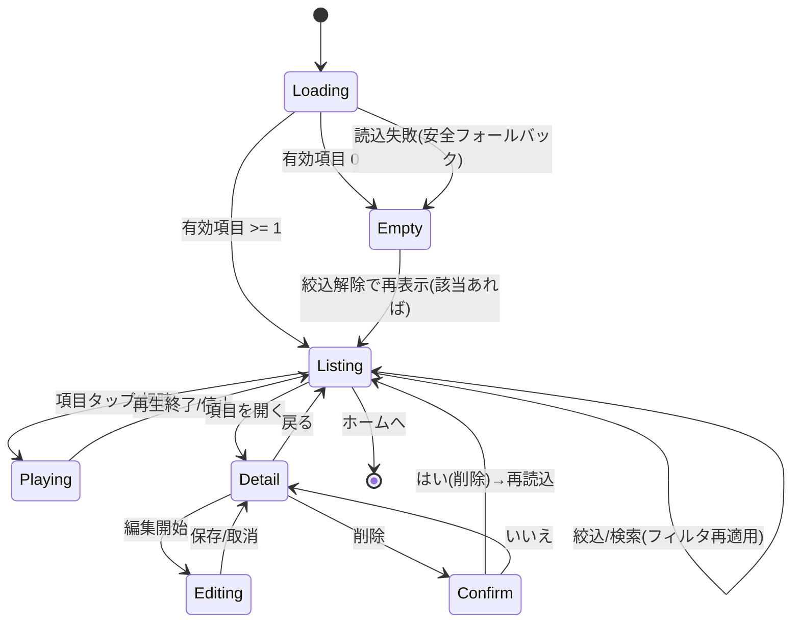

# U4 Persistence/Collection — Business Logic Model（業務ロジック・データフロー）

**ユニット**: U4 Persistence/Collection
**作成**: 2026-07-15 / AI-DLC CONSTRUCTION / Functional Design（Part 2）
**技術非依存**: 原子的置換の具体 API・スクロール仮想化・写真ピッカー実装・再生の技術配置は NFR Design / Code Generation。

> すべての I/O は `Result`（理由コード）で成否を返し、**致命的でない失敗はクラッシュさせず** `ErrorPresenter` で子ども向けに平易通知する（NFR-07 / SECURITY-15）。

---

## 1. 画面状態モデル（Collection / Q7=A）

コレクションは 1 画面（一覧＋絞込/検索＋詳細・編集＋空状態）。状態は以下。

**テキスト代替（状態遷移）**:
- `Loading`: 起動/表示時に一覧を読み込む。→ 有効 0 件なら `Empty`、1 件以上なら `Listing`、読込失敗も安全に `Empty`（フォールバック）。
- `Listing`: 一覧表示。項目タップで `Playing`（視聴）、項目を開くと `Detail`、絞込/検索で自身を再フィルタ。
- `Playing`: 保存エフェクトを再適用して再生。終了/停止で `Listing`。
- `Detail`: メタ表示。`Editing` で編集、削除で `Confirm`。
- `Editing`: タイトル/写真/メモ編集 → 保存/取消で `Detail`。
- `Confirm`: 削除確認（既定＝いいえ）。はい＝削除→再読込→`Listing`、いいえ＝`Detail`。
- `Empty`: 空状態表示。絞込解除で該当あれば `Listing`。

---

## 2. 一覧読込フロー（US-COL-01 / US-COL-04 / Q3=A）
1. `CollectionScreenController.OnShow()` → `IStorageService.ListSounds()` を要求。
2. `StorageService` は `sounds/` の `*.meta.json` を走査し、各 meta を読む。
   - meta が破損（パース不可/`meta==null`）→ **スキップ**（`skippedCount++`）。
   - 対 `wav` が欠損 → **スキップ**（対の原則 / BR-COL-21）。
   - 有効なもののみ `items` に追加。
3. 返却は「有効項目リスト」（＋読み飛ばし件数）。**1 件も無ければ空状態**（BR-COL-22）。
4. コントローラは現在の `CollectionQuery`（絞込/検索）を適用して描画。
5. どの段階の例外も捕捉し、最悪でも空状態にフォールバック（クラッシュしない）。

## 3. 視聴（再生）フロー（US-COL-01 / Q7=A）
1. 一覧項目タップ → 対象 `SavedSound` を特定。
2. `IStorageService.LoadSound(id)`（メタ）＋ wav デコード（`WavCodec.Decode`）で `AudioBuffer` を得る。
3. **保存エフェクト（`SoundEffectSettingsData`）を非破壊で再適用**して再生（録音時と同じ聴こえ）。
   - 再生の技術配置（共有再生サービス / `IAudioService` 拡張 / U3 `EffectChain` の共有化）は **NFR Design** で確定。
4. 再生失敗（ファイル欠損/破損）→ `Result` で通知し、該当項目を安全に扱う（一覧は維持）。
5. 別項目タップ/停止で現在再生を停止してから切替。

## 4. メタ編集フロー（US-COL-02 / Q2=A / Q4=A）
1. `Detail` で「編集」→ `Editing`。タイトル/写真/メモを変更可能（ニックネームは基本読み取り＝プロフィール由来）。
2. 保存押下 → メタ検証（BR-COL-12〜14）→ `SoundClipMeta` を更新 → **`{id}.meta.json` を原子的に置換**（一時ファイル→置換）。
3. 写真の差し替え: `IPhotoPicker`（抽象）で選択 → 一時パス → `sounds/{id}.photo.<ext>` へ原子的コピー → `photoFileName` 更新 → meta 保存。
4. 写真削除: `photoFileName` を空にし、写真ファイルを削除（欠損は無視）。
5. 失敗時は既存 meta を壊さない（原子性）。`Result(IOError)` で通知。

## 5. 削除フロー（US-COL-01 / Q6=A）
1. `Detail`/一覧の削除 → `ConfirmDialog`（「けす？」・既定＝いいえ）。
2. はい → `IStorageService.DeleteSound(id)`:
   - `{id}.wav` / `{id}.meta.json` / `{id}.photo.*` を削除（欠損は無視＝ベストエフォート）。
   - 途中失敗は `Result` で通知。可能な範囲で削除を進め、一覧は再読込で整合。
3. 削除後 → 一覧・絞込結果を即時更新。空になれば `Empty`。

## 6. 絞込・検索フロー（US-COL-03 / Q5=A）
1. `FilterSearchController` が `CollectionQuery`（`yearMonth` / `keyword`）を保持。
2. 変更時、**純粋関数** `Filter(items, query) -> filtered` を適用（副作用なし・テスト容易）。
   - 月別: 各項目の `createdAtIso` から `YYYY-MM` を導出し `yearMonth` と一致。
   - 検索: `title`/`memo`/`nickname` を正規化して `keyword` を含むか。
   - 両者 AND。
3. `filtered` が空 → 空状態（「みつからなかったよ」等）。絞込解除で復帰。

## 7. 原子的保存・堅牢性の共通モデル（US-TECH-06 / NFR-07 / Q3=A）
- **書込（新規/更新）**: 「一時ファイルへ全内容を書く → 成功後に本ファイルへ原子的置換」。途中失敗でも既存データは無傷。対象＝`profile.json` / `{id}.meta.json` / `{id}.wav` / 写真。
  - U3 の `SaveSound`（wav→meta・失敗時 wav 削除）を、本モデルの**原子的置換**へ強化（後方互換：シグネチャは維持）。
- **読込**: 破損/欠損は例外を握りつぶさず捕捉し、当該項目のみ**安全にスキップ**、他は正常表示。
- **空/初期**: ディレクトリ無し/0 件は空状態（例外にしない）。
- **重要度**: Rec/Collection = **Critical**（RESILIENCY-01）。ログに PII を出さない（SECURITY-03）。

---

## 8. コンポーネント責務（ふるまい）
| コンポーネント | 責務 |
|---|---|
| `CollectionScreenController`（`ScreenRootBase`） | 画面状態統括・一覧読込・子コントローラ調停・戻る/ホーム遷移 |
| `SoundListView` | 有効項目の一覧描画（レスポンシブ・固定px依存排除）・タップ通知 |
| `SoundDetailController` | 詳細表示・メタ編集（title/photo/memo）・削除起動 |
| `FilterSearchController` | `CollectionQuery` の保持・純粋 `Filter` 適用・空状態制御 |
| `IStorageService`（強化） | 原子的書込・破損スキップ・`DeleteSound`・（メタ更新）・写真 I/O |
| `IAudioService`（再生） | 保存音の再生（エフェクト再適用の配置は NFR Design） |
| `ConfirmDialog`/`ErrorPresenter`（U1 再利用） | 削除確認・失敗の平易通知 |

---

## 9. トレース
FR-09→§2/§3/§5 ／ FR-10→§4 ／ FR-11→§6 ／ FR-12→§7・レイアウト ／ US-COL-04・US-TECH-06→§2/§7（破損スキップ・原子性・空フォールバック）／ NFR-04→PII 非送信 ／ NFR-05→確認/空状態/平易通知 ／ NFR-07→§7 ／ RESILIENCY-01→Critical。
