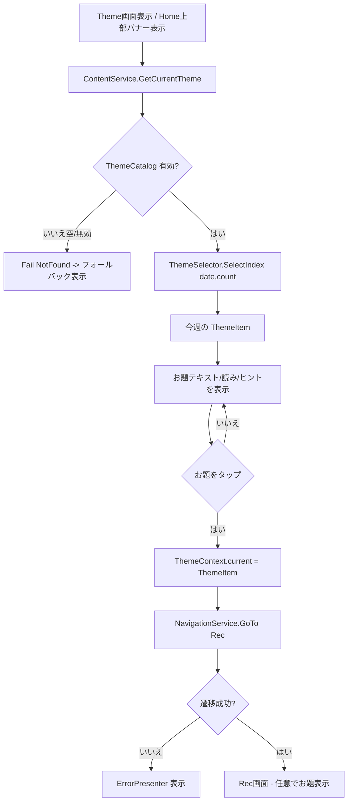

# U5 weekly theme — Business Logic Model（業務ロジック・データフロー）

**ユニット**: U5 weekly theme（お題）
**作成**: 2026-07-16 / AI-DLC CONSTRUCTION / Functional Design（Part 2）

> 技術非依存の振る舞い記述。純粋ロジック（週選択）と副作用（表示・遷移）を分離する。

---

## 1. 主要ユースケースと振る舞い

### UC-1 今週のお題を表示（US-THEME-01 / FR-13）
1. 画面表示時、`ContentService.GetCurrentTheme()` を呼ぶ。
2. `ContentService` は注入された `ThemeCatalog` の有効項目数 `count` を数える。
3. `ThemeSelector.SelectIndex(now, count)` で今週の index を決定（純粋関数）。
4. index が有効なら該当 `ThemeItem` を `Result.Ok` で返す。カタログが空/無効なら `Result.Fail`（`NotFound`）。
5. UI は成功時にお題本文（＋任意で読み/ヒント）を表示。失敗時はフォールバック表示（BR-THEME-21）。

### UC-2 週が替わると自動で切り替わる（US-THEME-01 AC2）
- 選択は「表示時点のローカル日時」に基づく純粋関数のため、週が替われば次回表示で自動的に別のお題になる（状態を持たない）。
- 実行中に日付が跨いだ場合の即時更新は要件外（次回表示で反映）。任意で `Refresh()` を提供。

### UC-3 お題タップから Rec へ（US-THEME-02 / FR-13）
1. ユーザーがお題（またはお題内の「録音する」導線）をタップ。
2. 現在の `ThemeItem` を `ThemeContext.current` に設定。
3. `INavigationService.GoTo(SceneId.Rec)` を実行。
4. 遷移失敗は `Result` で受けて `ErrorPresenter` 表示（クラッシュしない）。
5. Rec 画面は**任意で** `ThemeContext.current` を参照し「どのお題か」を表示（表示しなくても録音は成立）。

### UC-4 お題の差し替え（US-THEME-03 / FR-14）
- Sさん が `ThemeCatalog` アセットの `items` を編集（追加/変更/並べ替え）。
- 再ビルド不要でデータとして反映（次回表示で更新後のお題が出る）。

---

## 2. 週選択ロジック（純粋関数 / Q2=A）

`ThemeSelector.SelectIndex(DateTime date, int count) -> int`

- 目的: 「今日が年内の第何週か」を求め、`count` で剰余して index を返す（既存 `WeeklyTextController` の週番号ロジックを純粋化）。
- 手順（概念）:
  1. `count <= 0` の場合は `-1`（お題なし）を返す。
  2. その年の最初の月曜日を基準に、`date` までの経過週（`(date - firstMonday).Days / 7 + 1`）で週番号 `w` を求める。
  3. `date` が最初の月曜より前なら前年扱い（既存挙動を踏襲）。
  4. `index = ((w % count) + count) % count`（0..count-1 に正規化）。
- 性質（PBT 対象 / Q7=A）: 戻り値は常に `-1`（count<=0）または `0..count-1`；同一入力で決定的；`count` に対して剰余一致。

---

## 3. コンテンツ取得ロジック（Q5=A）

`ContentService`（`IContentService` 実装 / `Geidai.Services.Content`）
- `GetText(string key)`:
  - `key == "theme.current"` → 今週のお題の `text` を `Result.Ok`。
  - 未対応キー → `Result.Fail(NotImplemented)`（U6 で拡張）。
- `GetCurrentTheme() -> Result<ThemeItem>`（後方互換で追加）:
  - `ThemeCatalog` 未設定/空 → `Result.Fail(NotFound, "おだいが まだ ないよ")`。
  - `ThemeSelector.SelectIndex` の結果が有効 → 該当 `ThemeItem` を返す。
- `ThemeCatalog` は起動時に Service へ注入（`AppManager` or `ThemeBootstrap`）。

---

## 4. データフロー（Mermaid）

---

## 5. エラー・境界時の振る舞い
- カタログ空/全項目無効 → フォールバック表示（お題なし・録音導線は無効 or ホームへ）。クラッシュしない（BR-THEME-21）。
- 遷移失敗（Rec シーン未登録等）→ `Result.Fail` を UI 通知（BR-THEME-31）。
- `ThemeContext` 未設定で Rec に入った場合 → Rec は「お題表示なし」で通常録音（US-THEME-02 は任意表示）。

## 6. トレース
US-THEME-01→UC-1/UC-2・ThemeSelector・ContentService ／ US-THEME-02→UC-3・ThemeContext・NavigationService ／ US-THEME-03→UC-4・ThemeCatalog（SO 差し替え） ／ FR-13/14→本モデル ／ NFR-05→平易表示・フォールバック ／ NFR-09→ThemeSelector PBT。
