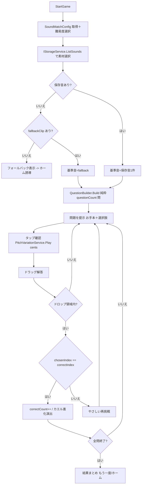

# U6 Game①音合わせ — Business Logic Model（業務ロジック・データフロー）

**ユニット**: U6 Game①音合わせ
**作成**: 2026-07-16 / AI-DLC CONSTRUCTION / Functional Design（Part 2）

> 純粋ロジック（出題生成・判定）と副作用（発音・演出・遷移）を分離する。

---

## 1. 主要ユースケース

### UC-1 ゲーム開始（US-GAME1-01/05）
1. `SoundMatchGameController.StartGame()`：`ContentService`/インスペクタから `SoundMatchConfig` を取得、難易度を選択（既定=ふつう）。
2. 素材選択：`IStorageService.ListSounds()` から1件（既定ランダム・シード可）。0 件なら `fallbackClip`。どちらも無ければフォールバック表示→ホーム誘導（BR-GAME1-02）。
3. 出題生成：`questionCount` 回 `QuestionBuilder.Build(baseSoundId, config, difficulty, seed)` → `GameSession` に格納。
4. 最初の問題を提示。

### UC-2 出題生成（純粋 / US-GAME1-02・FR-19）
- `QuestionBuilder.Build(...)`（純粋）:
  1. `targetCents` を決定（例: 0 を基準、または seed でランダムなオフセット）。
  2. `choiceCount` 個のセントを生成：1 つは `targetCents`（正解）、他は `targetCents ± k*centsStep`（重複せず・`centsStep` 以上離す）。
  3. 並びをシャッフル（seed 依存・決定的）、`correctIndex` を記録。
- 音は作らない（メタのみ）。**PBT**：正解ちょうど1つ・距離条件・決定的。

### UC-3 タップ確認（US-GAME1-01）
- お手本（カエル）タップ→ `PitchVariationService.Play(baseBuffer, targetCents)`。
- 選択肢（おたまじゃくし）タップ→ `PitchVariationService.Play(baseBuffer, choice.cents)`。
- 再生は非破壊・非保存（`AudioSource.pitch` 適用）。連打は現在再生を停止して差し替え。

### UC-4 ドラッグ解答・判定（US-GAME1-01/03）
1. 選択肢を uGUI ドラッグ → お手本ドロップ領域で離す。
2. 領域外 → 元位置へ戻す（やり直し可）。
3. 領域内 → 解答確定：選択した `choiceIndex == correctIndex` を純粋判定。
4. 正解 → `correctCount++`、`ResultEffectController.PlayCorrect()`（カエル進化）→ 次問へ。
5. 不正解 → `ResultEffectController.PlayRetry()`（やさしい再挑戦・ペナルティなし）→ 同じ問題を継続。

### UC-5 進行・終了（US-GAME1-03）
- 全問終了（`GameSession.isFinished`）→ 結果まとめ（正解数）表示 → もう一度 / ホーム。

### UC-6 パラメータ調整（US-GAME1-04 / FR-18）
- Sさん が `SoundMatchConfig`（SO）で 出題数/選択肢数/難易度セントを調整 → 次回開始時に反映（再ビルド不要）。

---

## 2. 判定ロジック（純粋）
- `bool IsCorrect(Question q, int chosenIndex) => chosenIndex == q.correctIndex;`
- 集計は `GameSession` が保持（副作用は Controller 側）。

## 3. ピッチ加工ロジック（非保存 / Q3=A）
- `PitchVariationService.Play(AudioBuffer baseBuffer, int cents)`：
  - `AudioSource.pitch = (float)PitchMath.CentsToRatio(cents)` を設定して再生。
  - 加工済みバッファを生成/保存しない（低遅延・低GC / NFR-03/06）。
- 将来の音色/強弱は IF 拡張余地として残す（U6 はピッチ主軸）。

---

## 4. データフロー（Mermaid）

---

## 5. エラー・境界時の振る舞い
- 保存音 0 件＋fallback 無し → フォールバック表示（クラッシュしない）→ ホーム誘導（BR-GAME1-02）。
- 基準バッファ読込失敗（`LoadSoundBuffer` Fail）→ その素材をスキップして別の保存音 or fallback、無ければフォールバック表示。
- `choiceCount`/`questionCount` 異常値 → クランプ（BR-GAME1-21）。
- 再生失敗 → `ErrorPresenter` 通知・ゲーム継続。

## 6. トレース
US-GAME1-01→UC-1/3/4 ／ US-GAME1-02→UC-2（要素はピッチ主軸・拡張余地） ／ US-GAME1-03→UC-4/5（演出・再挑戦） ／ US-GAME1-04→UC-6（Config） ／ US-GAME1-05→UC-1/2/3（保存音・非保存加工）。FR-15〜19・NFR-03/05/06 に整合。
