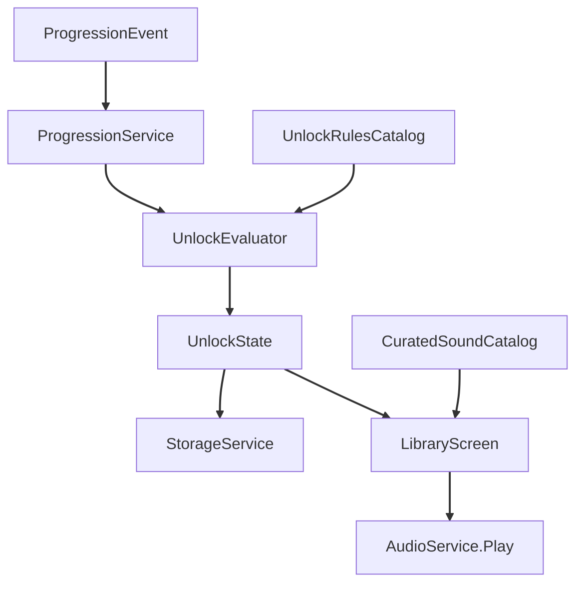

# U7 Sound Library — Business Logic Model

**ユニット**: U7 Sound Library  
**作成**: 2026-07-30

## 1. 主フロー

### 音図鑑表示
1. ContentService から CuratedSoundCatalog を取得
2. StorageService から UnlockState を読込（破損時は空）
3. 各 Definition を locked/unlocked に投影
4. unlocked のみ試聴可。locked は解除条件概要を表示

### アンロック更新
1. Rec 保存成功 or Game クリアが ProgressionEvent を発行
2. ProgressionService が UnlockRulesCatalog と UnlockEvaluator で対象IDを決定
3. UnlockState に追加（冪等）し原子的保存
4. 開いている Library があれば再投影

### 素材参照
- Create / Game は同一 CuratedSoundId で ContentService から定義を解決
- 未知IDは Result.NotFound（クラッシュしない）

## 2. フロー図

### テキスト代替
Event → ProgressionService → UnlockEvaluator(+Rules) → UnlockState → Storage  
Catalog + UnlockState → LibraryScreen → AudioService（試聴）

## 3. エラー／境界
| 状況 | 挙動 |
|---|---|
| 空カタログ | 空状態UI。クラッシュしない |
| 破損 unlock-state | 空で開始し警告（個人情報なし） |
| 未知 soundId | スキップ／NotFound |
| 同一条件再達成 | 状態変化なし（冪等） |
