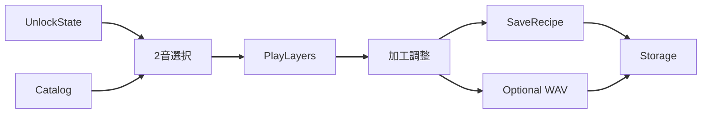

# U8 Sound Create — Business Logic Model

**作成**: 2026-07-30

## 主フロー
1. UnlockState から選択可能素材を取得
2. 2音を選ぶ → AudioService.PlayLayers で試聴
3. 各レイヤーの加工を調整 → プレビュー更新
4. 保存 → SoundRecipe を原子的保存
5. 再編集 → レシピ読込 → ID解決 → UI復元
6. 任意書き出し → Render → WAVE 保存（失敗時クリーンアップ）

## フロー図

### テキスト代替
UnlockState+Catalog → 2音選択 → 試聴/加工 → SaveRecipe および任意 Export → Storage

## 境界
| 状況 | 挙動 |
|---|---|
| 解除音が2未満 | 選択不可／解除促進 |
| 参照ID欠損 | 不足表示、再編集または削除 |
| 書き出し失敗 | 不完全ファイル削除、通知 |
