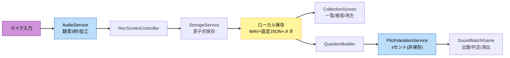

# Component Dependency（依存関係・通信・データフロー）

**プロジェクト**: 藝大 須藤さんアプリ
**作成**: 2026-07-15 / AI-DLC Application Design（Part 2）

---

## 1. 依存マトリクス（→ = 依存する / 呼び出す）

| From \ To | Common | Storage | Audio | Pitch | Nav | Content | AppMgr |
|---|:---:|:---:|:---:|:---:|:---:|:---:|:---:|
| Foundation (U1) | → | → | | | → | → | ← |
| Rec (U2) | → | → | → | | → | → | |
| Collection (U3) | → | → | (再生) | | → | | |
| Theme (U4) | → | | | | → | → | |
| Game1 (U5) | → | → | → | → | → | → | |
| Services | → | - | - | - | - | - | - |

- 依存は上位（モジュール）→ Services → Common の一方向。**Common は他へ依存しない**（循環なし）。
- Collection の音再生は AudioService の再生機能のみ利用（録音は不要）。

## 2. 通信パターン
- **画面遷移**: 各 ScreenController → `NavigationService.GoTo(SceneId)`（enum）。イベント/コールバックで戻り。
- **永続化**: 各モジュール → `StorageService`（同期API＋失敗は Result 型）。直接ファイルI/Oを触らない。
- **音声**: Rec/Game → `AudioService`（録音/再生/加工）。Game の出題加工のみ `PitchVariationService`。
- **コンテンツ取得**: Theme/Game/UI → `ContentService`（ScriptableObject/JSON）。Sさん の調整はアセット/設定側で完結。
- **起動**: `AppManager` がサービス初期化と最初の遷移をオーケストレーション。

## 3. データフロー（録音→保存→コレクション→ゲーム出題）



### テキスト代替（Data Flow）
1. マイク入力 → AudioService（3秒録音・加工）
2. → RecScreenController（プレビュー/保存操作）
3. → StorageService（原子的保存）→ ローカル保存（WAV＋設定JSON＋メタ）
4. ローカル保存 → CollectionScreen（一覧/検索/再生）
5. ローカル保存 → QuestionBuilder → PitchVariationService（±セント・非保存）→ SoundMatchGame（出題/判定/演出）

## 4. 永続化レイアウト（案 / persistentDataPath 配下）
```
persistentDataPath/
├── profile.json                # UserProfile
├── sounds/
│   ├── {id}.wav                # 加工済み WAVE(16bit PCM)
│   └── {id}.meta.json          # SoundClipMeta + SoundEffectSettings
└── settings/
    └── *.json                  # 各種設定
```
- 保存は一時ファイル→原子的置換。`{id}.wav` と `{id}.meta.json` は対で扱い、片方欠損時は該当項目を読み飛ばす（NFR-07）。

## 5. リスク/留意点
- **循環依存の回避**: Common は最下層に固定。モジュール間の直接参照は禁止（必要な連携は Services 経由）。
- **AsmDef 境界**: モジュール分割時、既存 `Assembly-CSharp` からの段階移行が必要（U1 で基盤整備）。
- **シーン結合**: 現状シーン分割型。NavigationService 導入で文字列依存を解消（FR-02）。
