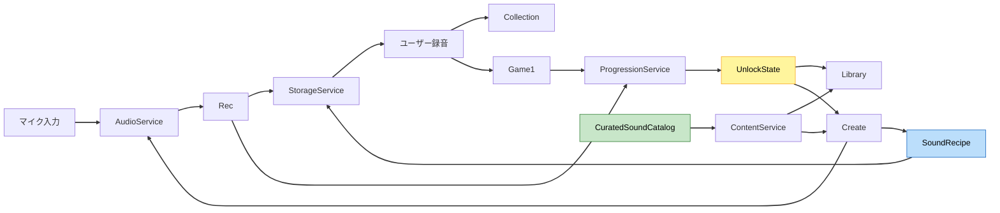

# Component Dependency（依存関係・通信・データフロー）

**プロジェクト**: 藝大 音響教育アプリ
**作成**: 2026-07-15 / AI-DLC Application Design（Part 2）
**更新**: 2026-07-30 / フェーズC（音図鑑・音づくり）差分

---

## 1. 依存マトリクス（→ = 依存する / 呼び出す）

| From \ To | Common | Storage | Audio | Pitch | Nav | Content | Progression | AppMgr |
|---|:---:|:---:|:---:|:---:|:---:|:---:|:---:|:---:|
| Foundation | → | → | | | → | → | | ← |
| Rec | → | → | → | | → | → | → | |
| Collection | → | → | → | | → | | | |
| Theme | → | | | | → | → | | |
| Game1 | → | → | → | → | → | → | → | |
| Library | → | → | → | | → | → | → | |
| Create | → | → | → | | → | → | → | |
| Services | → | - | - | - | - | - | - | - |

- 依存は上位（モジュール）→ Services → Common の一方向。**Common は他へ依存しない**（循環なし）。
- Library / Create は Collection / Rec に直接依存しない。素材・解除は Content + Progression + Storage 経由。

## 2. 通信パターン
- **画面遷移**: 各 ScreenController → `NavigationService.GoTo(SceneId)`（enum）。Library / Create を追加。
- **永続化**: 各モジュール → `StorageService`。直接ファイルI/Oを触らない。
- **音声**: Rec/Game/Library/Create → `AudioService`。Game の出題加工のみ `PitchVariationService`。
- **進行**: Rec保存成功・Gameクリア → `ProgressionService` → UnlockState。
- **コンテンツ取得**: Theme/Game/Library → `ContentService`（カタログ・解除条件含む）。
- **起動**: `AppManager` がサービス初期化と最初の遷移をオーケストレーション。

## 3. データフロー（既存＋フェーズC）



### テキスト代替（Data Flow）
1. マイク → AudioService → Rec → Storage（ユーザー録音）
2. ユーザー録音 → Collection / Game1
3. Gameクリア・録音課題 → ProgressionService → UnlockState
4. CuratedSoundCatalog → ContentService → Library / Create
5. Create → SoundRecipe → Storage（素材ID＋パラメータ）
6. Create → AudioService（レイヤー試聴・任意WAVE書き出し）

## 4. 永続化レイアウト（案 / persistentDataPath 配下）
```
persistentDataPath/
├── profile.json
├── unlock-state.json
├── sounds/
│   ├── {id}.wav
│   └── {id}.meta.json
├── recipes/
│   └── {recipeId}.json
└── exports/                    # 任意WAVE書き出し（必要時のみ）
    └── {exportId}.wav
```
- 同梱カタログ音声は `Assets`（読み取り専用）。UnlockState / Recipe は原子的置換。
- Recipe は素材ID参照のみ。未知ID・欠損は読み飛ばし／不足表示（NFR-14）。

## 5. リスク/留意点
- **循環依存の回避**: Common は最下層。モジュール間の直接参照は禁止。
- **進行イベント契約**: GameN / Rec は ProgressionService のイベント型のみに依存。
- **容量**: 50〜100音の圧縮後ビルド容量を実測し、ロード方式を調整（NFR-13）。
- **共同開発**: Create のDSP変更と Library のUI変更は並行可能。共通IF破壊はレビュー必須（NFR-15）。
