# Execution Plan（実行計画）

**プロジェクト**: 藝大 須藤さんアプリ
**作成**: 2026-07-15 / AI-DLC Workflow Planning
**入力**: `../requirements/requirements.md`、`../user-stories/stories.md`、`../user-stories/personas.md`、`../reverse-engineering/*`

---

## 1. 詳細分析サマリ（Detailed Analysis Summary）

### 1.1 変革スコープ（Brownfield）
- **Transformation Type**: アプリケーション変更（＋既存実装の整理/リファクタ）。インフラ/デプロイモデルの変更なし。
- **Primary Changes**:
  - 既存 Unity 実装のエンハンス（Rec の加工・保存、Collection のメタデータ拡張、weekly theme の Rec 導線、①音合わせのユーザー音出題）
  - 整理/リファクタ（録音実装を VoiceRecordingSection に一本化、`RecorderWithEffects`/`Scean.cs` 等の不要コード整理、Place 導線除外・遷移不具合解消）
  - 非機能の新設（レスポンシブUI/CanvasScaler 再設定、SafeArea 追従コンポーネント、データ堅牢性、PBT）
- **Related Components**: Unity シーン（Main/Home/Rec/Collection/weekly theme/Game①）、音声処理（AudioFilter/DSP）、ローカル永続化（persistentDataPath）、UI（uGUI/Canvas）。クラウド/CDK/API 等は該当なし。

### 1.2 変更影響アセスメント（Change Impact Assessment）
- **User-facing changes**: Yes — 画面遷移・録音/加工/保存・コレクション・お題・ゲームの体験に直接影響。
- **Structural changes**: Yes（限定的）— 録音実装の一本化、シーン導線の再構成（Place 除外）。アーキテクチャは既存のシーン分割型を踏襲。
- **Data model changes**: Yes — 保存メタデータ拡張（タイトル/写真/メモ/ニックネーム）、`SoundEffectSettings` の対保存、ユーザー登録情報の永続化。
- **API changes**: No（外部API/ネットワーク境界なし・完全オフライン）。内部モジュール間IFのみ整理。
- **NFR impact**: Yes — パフォーマンス（リアルタイム加工）、プライバシー/セキュリティ（ローカルPII）、レスポンシブ/SafeArea、データ堅牢性、テスト容易性（PBT）。

### 1.3 コンポーネント関係（Brownfield）
- **Primary Component**: Rec（録音・加工・保存）＝体験と技術の中心。
- **Shared Components**: ローカル永続化（音声WAV＋設定JSON＋メタデータ）、UI基盤（Canvas/SafeArea/レスポンシブ）、ナビゲーション基盤。
- **Dependent Components**: MySoundCollection（Rec の保存物に依存）、①音合わせ（保存音＋リアルタイム加工に依存）、weekly theme（Rec 導線に依存）。
- **Supporting Components**: 変更管理（Git/PR、Unity MCP 経由のシーン操作）、テスト（PBT/ユニット）。

| コンポーネント | Change Type | Change Reason | Priority |
|---|---|---|---|
| Rec / 録音実装一本化 | Major | 重複実装統合・保存仕様 | Critical |
| ローカル永続化/堅牢性 | Major | メタデータ拡張・原子的保存 | Critical |
| UI基盤（レスポンシブ/SafeArea） | Major(新設) | 端末横断・両向き対応 | Important |
| ナビゲーション/Place除外 | Minor | 導線整理・不具合修正 | Important |
| MySoundCollection | Minor | 一覧/検索/メタ表示 | Important |
| weekly theme | Minor | 表示＋Rec導線＋差し替え構成 | Important |
| ①音合わせ | Major | ユーザー音出題・セント難易度 | Important |

### 1.4 リスクアセスメント（Risk Assessment）
- **Risk Level**: **Medium** — 複数モジュール横断＋録音実装のリファクタを含むが、単一アプリ・オフライン・Git でロールバック容易。
- **Rollback Complexity**: Easy〜Moderate（Git ブランチ/PR、Unity シーン差分は要注意）。
- **Testing Complexity**: Moderate（音声処理・リアルタイム加工・PBT 導入）。
- **前提リスク**: 研究会後に確定する仕様（出題数/音域/音長/微分音/難易度細部）があり「暫定・更新前提」。差し替え可能な構成で吸収する。

---

## 2. ワークフロー可視化（Workflow Visualization）

```mermaid
flowchart TD
    Start(["User Request"])

    subgraph INCEPTION["INCEPTION PHASE"]
        WD["Workspace Detection<br/>COMPLETED"]
        RE["Reverse Engineering<br/>COMPLETED"]
        RA["Requirements Analysis<br/>COMPLETED"]
        US["User Stories<br/>COMPLETED"]
        WP["Workflow Planning<br/>IN PROGRESS"]
        AD["Application Design<br/>EXECUTE"]
        UG["Units Generation<br/>EXECUTE"]
    end

    subgraph CONSTRUCTION["CONSTRUCTION PHASE"]
        FD["Functional Design<br/>EXECUTE"]
        NFRA["NFR Requirements<br/>EXECUTE"]
        NFRD["NFR Design<br/>EXECUTE"]
        ID["Infrastructure Design<br/>SKIP"]
        CG["Code Generation<br/>EXECUTE"]
        BT["Build and Test<br/>EXECUTE"]
    end

    subgraph OPERATIONS["OPERATIONS PHASE"]
        OPS["Operations<br/>PLACEHOLDER"]
    end

    Start --> WD
    WD --> RE
    RE --> RA
    RA --> US
    US --> WP
    WP --> AD
    AD --> UG
    UG --> FD
    FD --> NFRA
    NFRA --> NFRD
    NFRD --> ID
    ID --> CG
    CG --> BT
    BT --> OPS
    OPS --> End(["Complete"])

    style WD fill:#4CAF50,stroke:#1B5E20,stroke-width:3px,color:#fff
    style RE fill:#4CAF50,stroke:#1B5E20,stroke-width:3px,color:#fff
    style RA fill:#4CAF50,stroke:#1B5E20,stroke-width:3px,color:#fff
    style US fill:#4CAF50,stroke:#1B5E20,stroke-width:3px,color:#fff
    style WP fill:#4CAF50,stroke:#1B5E20,stroke-width:3px,color:#fff
    style AD fill:#FFA726,stroke:#E65100,stroke-width:3px,stroke-dasharray: 5 5,color:#000
    style UG fill:#FFA726,stroke:#E65100,stroke-width:3px,stroke-dasharray: 5 5,color:#000
    style FD fill:#FFA726,stroke:#E65100,stroke-width:3px,stroke-dasharray: 5 5,color:#000
    style NFRA fill:#FFA726,stroke:#E65100,stroke-width:3px,stroke-dasharray: 5 5,color:#000
    style NFRD fill:#FFA726,stroke:#E65100,stroke-width:3px,stroke-dasharray: 5 5,color:#000
    style ID fill:#BDBDBD,stroke:#424242,stroke-width:2px,stroke-dasharray: 5 5,color:#000
    style CG fill:#4CAF50,stroke:#1B5E20,stroke-width:3px,color:#fff
    style BT fill:#4CAF50,stroke:#1B5E20,stroke-width:3px,color:#fff
    style OPS fill:#FFF59D,stroke:#F9A825,stroke-width:2px,color:#000
    style Start fill:#CE93D8,stroke:#6A1B9A,stroke-width:3px,color:#000
    style End fill:#CE93D8,stroke:#6A1B9A,stroke-width:3px,color:#000

    linkStyle default stroke:#333,stroke-width:2px
```

### テキスト代替（Text Alternative）
- **INCEPTION**: Workspace Detection(COMPLETED) → Reverse Engineering(COMPLETED) → Requirements Analysis(COMPLETED) → User Stories(COMPLETED) → Workflow Planning(IN PROGRESS) → Application Design(EXECUTE) → Units Generation(EXECUTE)
- **CONSTRUCTION**（ユニットごとにループ）: Functional Design(EXECUTE) → NFR Requirements(EXECUTE) → NFR Design(EXECUTE) → Infrastructure Design(SKIP) → Code Generation(EXECUTE) → Build and Test(EXECUTE)
- **OPERATIONS**: Operations(PLACEHOLDER)

---

## 3. 実行するフェーズ（Phases to Execute）

### 🔵 INCEPTION PHASE
- [x] Workspace Detection（COMPLETED）
- [x] Reverse Engineering（COMPLETED・概要把握レベル）
- [x] Requirements Analysis（COMPLETED）
- [x] User Stories（COMPLETED）
- [x] Workflow Planning（IN PROGRESS → 本ドキュメント）
- [ ] **Application Design — EXECUTE**
  - **Rationale**: 新設/改修コンポーネント（SafeArea 追従、録音一本化後の Rec 構成、weekly theme のデータ駆動、①音合わせのパラメータ/出題生成、永続化/堅牢性）のメソッド・責務・モジュール境界・依存関係を定義する必要がある。
- [ ] **Units Generation — EXECUTE**
  - **Rationale**: 複数モジュール（基盤/Rec/Collection/weekly theme/①音合わせ/技術イネーブラー）に分解し、Construction のユニット単位ループで段階実装するため。

### 🟢 CONSTRUCTION PHASE（各ユニットで実施）
- [ ] **Functional Design — EXECUTE**
  - **Rationale**: 新規データモデル（拡張メタデータ、`SoundEffectSettings` 対保存、ユーザー登録）と複雑ロジック（cents↔pitch、リアルタイム加工、WAV I/O）の詳細設計が必要。
- [ ] **NFR Requirements — EXECUTE**
  - **Rationale**: パフォーマンス（リアルタイム音声）、プライバシー/セキュリティ（ローカルPII）、レスポンシブ/SafeArea、データ堅牢性、PBT フレームワーク選定（例: FsCheck）等の確定が必要。
- [ ] **NFR Design — EXECUTE**
  - **Rationale**: NFR Requirements を実施するため、対応する設計パターン（原子的保存、SafeArea 実装方式、CanvasScaler 方針、テスト戦略）を具体化する。
- [ ] **Infrastructure Design — SKIP**
  - **Rationale**: サーバー/クラウド/CDK/ネットワーク等のインフラが存在しない完全オフラインのモバイルアプリ。デプロイは各ストアのビルド/署名で、インフラ設計対象なし（必要ならビルド設定は Build and Test で扱う）。
- [ ] **Code Generation — EXECUTE（ALWAYS）**
  - **Rationale**: 実装計画とコード生成が必要。
- [ ] **Build and Test — EXECUTE（ALWAYS）**
  - **Rationale**: ビルド・単体/統合テスト・PBT・検証が必要。

### 🟡 OPERATIONS PHASE
- [ ] Operations — PLACEHOLDER
  - **Rationale**: 将来のデプロイ/監視ワークフロー（現状はプレースホルダ）。

---

## 4. ユニット更新順序（Package/Unit Change Sequence, Brownfield）

- **Update Approach**: Sequential（依存順）＋一部並行可。
- **Critical Path**: 技術イネーブラー基盤（レスポンシブ/SafeArea/ナビ整理）→ Rec（録音一本化・保存）→ 永続化/堅牢性 → MySoundCollection → weekly theme → ①音合わせ。
- **Coordination Points**: 保存フォーマット（WAV＋設定JSON＋メタデータ）は Rec/Collection/①音合わせで共有 → 先に確定。UI基盤（Canvas/SafeArea）は全画面共通 → 早期に確立。
- **Testing Checkpoints**: Rec 保存フォーマット確定時、Collection 読込/堅牢性、①音合わせのリアルタイム加工の実機性能。

推奨順序（暫定）:
1. **U1 Foundation/UI基盤**（ナビ整理・Place除外・CanvasScaler・SafeArea） — 他ユニットの土台
2. **U2 Rec**（録音一本化・加工・WAV保存・設定対保存）
3. **U3 Persistence/Collection**（永続化・堅牢性・一覧/検索/メタ拡張・ユーザー登録）
4. **U4 weekly theme**（表示・Rec導線・差し替え構成）
5. **U5 Game①音合わせ**（出題・セント難易度・ユーザー音のリアルタイム加工出題・演出）

> ユニットの最終確定は Units Generation ステージで行う（本順序は計画時の想定）。

### 4.1 開発フロー・役割分担（UI 調整のハンドオフ）
実装フェーズの UI は、**基盤・統合担当が基本的な枠組み**を作り、**企画・デザイン担当が詳細な見た目を調整**する分担とする（要件 §7・US-TECH-07）。

- **基盤・統合担当**: レイアウト骨格・機能構造・画面遷移、レスポンシブ（CanvasScaler）/SafeArea 対応、データ/素材/パラメータの外部化（差し替え可能化）、動作する状態での引き渡し。
- **企画・デザイン担当**: 余白・配置・配色・アイコン/モチーフ配置・文言・素材差し替え等の見た目の詳細調整、お題テキストやゲームパラメータのコンテンツ調整。
- **設計への含意（Construction で反映）**: 各ユニット（特に U1 UI基盤・U4 weekly theme・U5 ①音合わせ）は、コード改修を伴わず（または最小限で）調整できるよう、**差し替え可能な素材/パラメータと柔軟なレイアウト**を前提に設計する。ハンドオフ時に調整箇所（Prefab/ScriptableObject/設定ファイル等）を明示する。
- **Coordination Point 追加**: 「基盤・統合担当が枠組みを提供 → 企画・デザイン担当が詳細調整」を各 UI ユニットのチェックポイントに含める。

---

## 5. 想定タイムライン（Estimated Timeline）

- **Total Stages（今回計画対象）**: INCEPTION 残り2（Application Design, Units Generation）＋ CONSTRUCTION（ユニット×[Functional/NFR×2/Code Gen]＋Build&Test）。
- **Estimated Duration**: 相対見積り（暦は助成金スケジュールに整合）。基盤〜最初のゲーム（フェーズA+B）を中間報告（2026-11）までの主要目標、ART DX EXPO（2027-03）に向けて調整。
- **注**: 研究会後の仕様確定で細部を更新（暫定・更新前提）。

---

## 6. 成功基準（Success Criteria）

- **Primary Goal**: 「録音 → 加工 → 自分の音で聴き分けるミニゲーム」のコア体験（フェーズA基盤＋フェーズB ①音合わせ）を、端末横断で破綻なく動作する MVP として実装可能な状態に設計・分解する。
- **Key Deliverables**: Application Design、Units（U1〜U5）、各ユニットの Functional/NFR 設計、コード、テスト。
- **Quality Gates**:
  - 全画面が縦・横／多様な端末サイズで破綻せず SafeArea 内で操作可能（NFR-11/12）。
  - 録音実装が VoiceRecordingSection に一本化（FR-07）、不要コード整理（NFR-08）。
  - ローカルデータの原子的保存・破損時フォールバック（NFR-07）。
  - PII を端末外に出さない・ログに出さない（NFR-04/Security）。
  - PBT（WAV/cents↔pitch/設定JSON のラウンドトリップ・不変条件）を導入（NFR-09）。
  - UI は基盤・統合担当が枠組みを提供し、企画・デザイン担当がコード改修を伴わず（または最小限で）詳細調整できる「調整余地」を備える（§4.1 / US-TECH-07）。
- **Integration Testing**: Rec→Collection→①音合わせ の保存物連携が一貫して動作。
- **Operational Readiness**: N/A（オフライン・サーバーなし。将来 Operations で検討）。

---

## 7. 次期変更計画（音図鑑・音づくり）

**状態**: Inception 変更計画承認済み。Construction（U7/U8）進行中。

### 7.1 変更する前提

- ユーザー間共有は第一弾で見送り、完全オフラインを維持する
- 制作側で確認した50〜100音程度の素材を音図鑑として同梱する
- ゲームクリアと指定音の録音・保存課題を組み合わせてローカルアンロックする
- アンロック済み素材を2音組み合わせ、加工・試聴・保存する最小の音づくりを実装する
- 素材IDと加工パラメータによるレシピを保存し、必要な場合だけWAVEへ書き出す
- 任意展示に向け、音図鑑を含む実機インストール可能な試用ビルドを用意する

### 7.2 推奨ワークストリーム

| ワークストリーム | 責務 | 変更境界 |
|---|---|---|
| 基盤・統合 | Common/Services、ナビゲーション、保存、アンロック基盤、シーン統合、ビルド | 共通IFと統合箇所 |
| 音響実装 | 音素材ロード、レイヤー再生、加工、レシピ再生／必要時の書き出し | Audioサービスの合意済みIF内 |
| 企画・デザイン | 素材カタログ、アンロック表、画面仕様、素材・演出、受入確認 | ScriptableObject、Prefab、仕様・素材 |
| ゲーム実装 | 追加ミニゲームをシーン・ルール・UI・テストまで縦割り実装 | `Geidai.GameN` の独立モジュール |

### 7.3 実装順序案

1. 要件・ストーリー承認
2. `CuratedSoundId`、カタログ、アンロック状態、音レシピ、Progression の共通契約を確定
3. U7 音図鑑の閲覧・試聴
4. アンロック判定と端末内永続化
5. U8 2音の組み合わせ・加工・試聴
6. レシピ保存・再編集・任意WAVE書き出し
7. Rec/Game1 との進行連携
8. 実機ビルド、容量・メモリ・音声遅延の測定（任意展示向け）

### 7.4 プライバシーと共同開発

- 計画・Issue・Pull Request には氏名、連絡先、所属詳細、個人の空き予定を記録しない
- 担当は役割名またはGitHub上の担当者指定で管理する
- 試用結果は匿名化し、端末識別子や個人情報をログへ出さない
- feature ブランチ＋Pull Request を用い、共通IFの破壊的変更は統合前にレビューする

### 7.5 プロジェクト上のマイルストーン

- 任意展示: 2026年11月20日〜12月2日。統合状況に応じた実機試用ビルド
- 必須展示: 2027年3月19日〜22日。実機へインストール可能な成果ビルド
- ストア公開は展示の必須条件とせず、別の公開判断と審査計画で扱う

### 7.6 変更計画の進捗

- [x] 変更計画用 feature ブランチを作成
- [x] 外部 Source of Truth へ最新方針を反映
- [x] 個人プロフィール・連絡手段・個人予定を計画から除外
- [x] 未確定事項を要件変更質問へ整理
- [x] 要件変更質問への回答・矛盾確認
- [x] Requirements を回答内容で更新
- [x] Requirements 承認（"OK"）
- [x] User Stories／Personas を差分更新
- [x] User Stories 承認（"OK"）
- [x] Application Design／Units を差分更新
- [x] Application Design／Units 承認（"OK"）
- [x] U7/U8 Functional Design + NFR Design
- [x] U7/U8 Code Generation Part1（計画）
- [ ] U7/U8 Code Generation Part2（生成）
