# Execution Plan — Fさん導入ドキュメント

**プロジェクト**: 藝大 音響教育アプリ（「音」）  
**作成**: 2026-08-19 / AI-DLC Workflow Planning  
**入力**: `../requirements/onboarding-f-requirements.md`  
**ブランチ**: `feature/onboarding-f-guide`

アプリ全体の実行計画は既存 `execution-plan.md` を正とする。本ファイルはこのワークストリームのみ。

---

## 1. Detailed Analysis Summary

### Transformation Scope (Brownfield)
- **Transformation Type**: Documentation only（アプリケーション構造の変更なし）
- **Primary Changes**: `docs/Fさん向けガイド.md` 新規、`README.md` 役割表、任意で Sさんガイドへ相互リンク
- **Related Components**: なし（C# / シーン / SO は変更しない）

### Change Impact Assessment
- **User-facing changes**: No — エンドユーザー向け機能は変わらない
- **Structural changes**: No
- **Data model changes**: No
- **API changes**: No
- **NFR impact**: No（ドキュメントの PII 非記載のみ）

### Component Relationships
- **Primary Component**: 人間向けドキュメント（`docs/`）
- **Infrastructure Components**: なし
- **Shared Components**: README がガイドへの入口
- **Dependent Components**: なし

### Risk Assessment
- **Risk Level**: Low
- **Rollback Complexity**: Easy（文書の差し戻し）
- **Testing Complexity**: Simple（パス・担当表・リンクの目視）

### Module Update Strategy
- **Update Approach**: Sequential（単一ドキュメントセット）
- **Critical Path**: 要件 → ガイド本文 → README
- **Coordination Points**: 担当表は 2026-08-18 打ち合わせ記録。企画本文は Drive を正とし複製しない
- **Testing Checkpoints**: ガイド内のファイルパスがリポジトリに存在すること

---

## 2. Workflow Visualization

### Mermaid

```mermaid
flowchart TD
    Start(["User Request"])

    subgraph INCEPTION["INCEPTION PHASE"]
        WD["Workspace Detection COMPLETED"]
        RE["Reverse Engineering SKIP"]
        RA["Requirements Analysis COMPLETED"]
        US["User Stories SKIP"]
        WP["Workflow Planning EXECUTE"]
        AD["Application Design SKIP"]
        UG["Units Generation SKIP"]
    end

    subgraph CONSTRUCTION["CONSTRUCTION PHASE"]
        FD["Functional Design SKIP"]
        NFRA["NFR Requirements SKIP"]
        NFRD["NFR Design SKIP"]
        ID["Infrastructure Design SKIP"]
        CG["Code Generation EXECUTE"]
        BT["Build and Test EXECUTE"]
    end

    subgraph OPERATIONS["OPERATIONS PHASE"]
        OPS["Operations PLACEHOLDER"]
    end

    Start --> WD
    WD --> RE
    RE --> RA
    RA --> US
    US --> WP
    WP --> AD
    AD --> UG
    UG --> FD
    FD --> NFRA
    NFRA --> NFRD
    NFRD --> ID
    ID --> CG
    CG --> BT
    BT --> OPS
    OPS --> End(["Complete"])

    style WD fill:#4CAF50,stroke:#1B5E20,stroke-width:3px,color:#fff
    style RA fill:#4CAF50,stroke:#1B5E20,stroke-width:3px,color:#fff
    style WP fill:#4CAF50,stroke:#1B5E20,stroke-width:3px,color:#fff
    style CG fill:#4CAF50,stroke:#1B5E20,stroke-width:3px,color:#fff
    style BT fill:#4CAF50,stroke:#1B5E20,stroke-width:3px,color:#fff
    style RE fill:#BDBDBD,stroke:#424242,stroke-width:2px,stroke-dasharray: 5 5,color:#000
    style US fill:#BDBDBD,stroke:#424242,stroke-width:2px,stroke-dasharray: 5 5,color:#000
    style AD fill:#BDBDBD,stroke:#424242,stroke-width:2px,stroke-dasharray: 5 5,color:#000
    style UG fill:#BDBDBD,stroke:#424242,stroke-width:2px,stroke-dasharray: 5 5,color:#000
    style FD fill:#BDBDBD,stroke:#424242,stroke-width:2px,stroke-dasharray: 5 5,color:#000
    style NFRA fill:#BDBDBD,stroke:#424242,stroke-width:2px,stroke-dasharray: 5 5,color:#000
    style NFRD fill:#BDBDBD,stroke:#424242,stroke-width:2px,stroke-dasharray: 5 5,color:#000
    style ID fill:#BDBDBD,stroke:#424242,stroke-width:2px,stroke-dasharray: 5 5,color:#000
    style OPS fill:#BDBDBD,stroke:#424242,stroke-width:2px,stroke-dasharray: 5 5,color:#000
    style Start fill:#CE93D8,stroke:#6A1B9A,stroke-width:3px,color:#000
    style End fill:#CE93D8,stroke:#6A1B9A,stroke-width:3px,color:#000
    style INCEPTION fill:#BBDEFB,stroke:#1565C0,stroke-width:3px,color:#000
    style CONSTRUCTION fill:#C8E6C9,stroke:#2E7D32,stroke-width:3px,color:#000
    style OPERATIONS fill:#FFF59D,stroke:#F57F17,stroke-width:3px,color:#000
    linkStyle default stroke:#333,stroke-width:2px
```



### Text Alternative

```
INCEPTION
- Workspace Detection: COMPLETED
- Reverse Engineering: SKIP
- Requirements Analysis: COMPLETED
- User Stories: SKIP
- Workflow Planning: EXECUTE
- Application Design: SKIP
- Units Generation: SKIP

CONSTRUCTION
- Functional Design: SKIP
- NFR Requirements: SKIP
- NFR Design: SKIP
- Infrastructure Design: SKIP
- Code Generation: EXECUTE
- Build and Test: EXECUTE

OPERATIONS
- Operations: PLACEHOLDER
```

---

## 3. Phases to Execute

### INCEPTION PHASE
- [x] Workspace Detection (COMPLETED)
- [x] Reverse Engineering (SKIPPED) — 既存成果物あり。本作業は文書のみ
- [x] Requirements Analysis (COMPLETED) — `onboarding-f-requirements.md` 承認
- [x] User Stories (SKIPPED) — ドキュメントのみ。ユーザー機能変更なし
- [x] Execution Plan (IN PROGRESS)
- [ ] Application Design - SKIP
  - **Rationale**: 新コンポーネント・サービス・メソッド定義なし
- [ ] Units Generation - SKIP
  - **Rationale**: 分解不要。文書セット 1 単位

### CONSTRUCTION PHASE
- [ ] Functional Design - SKIP
  - **Rationale**: 新しい業務ロジックなし。担当表と案内パスは要件に確定済み
- [ ] NFR Requirements - SKIP
  - **Rationale**: 性能・セキュリティ基盤の変更なし。PII 非記載は要件に含む
- [ ] NFR Design - SKIP
  - **Rationale**: NFR Requirements SKIP に追随
- [ ] Infrastructure Design - SKIP
  - **Rationale**: 完全オフライン。インフラ変更なし
- [ ] Code Generation - EXECUTE (ALWAYS)
  - **Rationale**: ガイド本文と README 更新。Part1 計画 → 承認 → Part2 生成
- [ ] Build and Test - EXECUTE (ALWAYS)
  - **Rationale**: パス存在確認、担当表と打ち合わせの一致、リンク切れなし

### OPERATIONS PHASE
- [ ] Operations - PLACEHOLDER

---

## 4. Code Generation で作るもの

単一ユニット `onboarding-f-guide`:

1. `docs/Fさん向けガイド.md`（導入編＋リファレンス編）
2. `README.md`（役割表・ドキュメント案内・必要ならシーン表）
3. `docs/Sさん向けガイド.md` に Fさんガイドへのリンクを 1 箇所

C# / Unity シーン / ScriptableObject は変更しない。

---

## 5. Package Change Sequence

該当なし（ドキュメントのみ）。

---

## 6. Estimated Timeline

- **Total Phases executing remaining**: Code Generation、Build and Test
- **Estimated Duration**: 1 セッション

---

## 7. Success Criteria

- **Primary Goal**: Fさんが担当シーン（音並べ・サウンドレスキュー・音作り）に、共通基盤を壊さず着手できる
- **Key Deliverables**: `docs/Fさん向けガイド.md`、README 更新
- **Quality Gates**: 要件 FR-ONB-01〜08 を満たす。コードパスが実在する。PII なし。企画本文の複製なし

---

## 8. Extension Compliance

| Extension | 判定 | 理由 |
|---|---|---|
| Security Baseline | 部分適用 | ドキュメントに PII を書かない。他ルールは N/A |
| Resiliency Baseline | N/A | 稼働・復旧の変更なし |
| Property-Based Testing | N/A | コード生成なし。ガイドで Game 追加時の PBT を案内するのみ |
