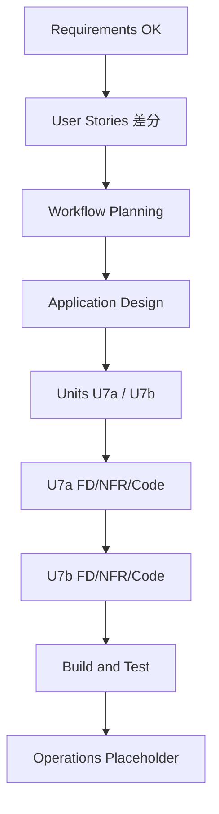

# サウンドライブラリ属性 — 実行計画（Workflow Planning）

**作成**: 2026-08-29  
**ブランチ**: `feature/sound-library-attributes`  
**要件**: `sound-library-attributes-requirements.md`（承認済み）  
**Stories**: `sound-library-attributes-stories.md`

---

## 1. スコープ・影響

| 領域 | 内容 |
|---|---|
| データ | `CuratedSoundDefinition` 新スキーマ置換。Catalog SO 再登録 |
| Editor | 新規 EditorWindow（WAV→属性→カタログ） |
| UI | `GeidaiLibrary` 刷新（ナンバー順・絞り込み・画像・HomeUiTheme） |
| API | Content/Catalog 読取を新属性対応。Create/Game 参照のコンパイル互換 |
| 非対象 | ゲーム出題ロジック、Collection 統合、ピッチシフト実装本体 |

**Risk**: Medium（スキーマ置換＋既存 Create 参照）

## 2. コンポーネント関係

```text
[Editor Window] ──書込──▶ CuratedSoundCatalog (SO)
                              │
                              ▼
                    CuratedSoundDefinition (新)
                              │
         ┌────────────────────┼────────────────────┐
         ▼                    ▼                    ▼
  LibraryScreen          IContentService      Create / Game*
  (一覧・絞込・試聴)      (読取 API)           (*読取のみ更新)
```

## 3. 推奨ステージ

| Stage | 判定 | 深さ | 理由 |
|---|---|---|---|
| User Stories | **EXECUTE**（差分済） | Standard | 複数ペルソナ・受入基準 |
| Application Design | **EXECUTE** | Standard | 新スキーマ・Editor・画面メソッド |
| Units Generation | **EXECUTE** | Minimal〜Standard | 1〜2 ユニットに分解 |
| Functional Design | **EXECUTE**（per-unit） | Standard | 属性・検証・UI 状態 |
| NFR Requirements / Design | **EXECUTE** | Minimal | 既存 NFR 踏襲＋Editor 検証 |
| Infrastructure Design | **SKIP** | — | オフライン・クラウド無し |
| Code Generation | **EXECUTE** | — | 常時 |
| Build and Test | **EXECUTE** | — | EditMode＋Play 確認手順 |

## 4. 推奨ユニット

| Unit | 内容 | 依存 |
|---|---|---|
| **U7a Schema & Catalog API** | 新 `CuratedSoundDefinition`、Catalog、ContentService 読取、旧資産廃止／再登録手順、EditMode 検証 | なし |
| **U7b Editor & Library UI** | EditorWindow、Library 画面（ソート／絞込／画像／試聴）、HomeUiTheme 適用、サンプル再登録 | U7a |

## 5. 可視化



## 6. Extension

| Extension | 本計画での扱い |
|---|---|
| Security | 端末内・PII非ログ |
| Resiliency | UnlockState AtomicFile 維持 |
| PBT | 属性検証・Catalog クエリの決定的テスト |

## 7. ユーザー制御

推奨から外したいステージがあれば指定してください（例: Application Design SKIP、Units を1本に統合 など）。

---

## 承認ゲート

**Workflow Planning 完了。この実行計画で進めてよいですか？**

- 変更があれば指示してください
- User Stories 差分と本計画の両方に問題なければ **OK** と返信してください
