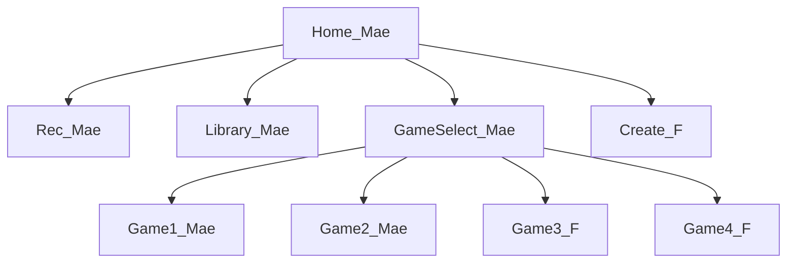

# Fさん導入ドキュメント — 要件

**プロジェクト**: 藝大 音響教育アプリ（「音」）  
**ワークストリーム**: Fさん向け導入ドキュメント  
**作成**: 2026-08-19  
**入力**: `onboarding-f-requirement-questions.md`（回答済み）＋ `/Users/maemoto/Downloads/20260818打ち合わせ記録.pdf`  
**企画の正**: Google Drive `プロジェクト概要.md`（2026-07-30）。本ファイルは導入ドキュメントの範囲のみを定義する。アプリ全体要件は既存 `requirements.md` を正とする。

---

## 1. Intent Analysis

| 項目 | 内容 |
|---|---|
| User request | 新メンバー Fさん向けの導入ドキュメントを作る。Fさんはゲーム開発・音楽理論設計が得意。シーン単位で前本と分担する |
| Request type | Documentation / onboarding（機能追加ではない） |
| Scope | リポジトリ内ガイド 1 本＋ README の役割表更新 |
| Complexity | Simple〜Moderate（分担表は打ち合わせ記録で確定。音響対応表は既存コードの要約） |
| Requirements depth | Standard |

---

## 2. 回答の確定（矛盾なし）

| Q | 回答 | 確定内容 |
|---|---|---|
| 1 | A | 成果物は `docs/Fさん向けガイド.md` |
| 2 | A と C | 二部構成。導入編は短くする（Unity / C# 経験は前提） |
| 3 | C | 環境・役割・Git・共通基盤に加え、音響／音楽理論の実装対応と、新ゲームシーン追加手順まで含める |
| 4・5 | 打ち合わせ記録 PDF | 担当は 2026-08-18 打ち合わせ記録のシーン表を正とする（下記 §4） |
| 6 | B | セント → pitch、`SoundMatchConfig`、Recipe 加工など実装対応表を書く |
| 7 | B | 見た目調整の要点を短く再掲し、詳細は Sさんガイドへリンク |
| 8 | A | README の役割表に Fさんを追加し、ガイドへリンクする |
| 9 | A | 役割名と手順のみ。個人の連絡先・所属詳細・私的な予定は書かない |
| 10 | A | Security / Resiliency / PBT は現行のまま。本作業の適用はほぼ N/A。ドキュメントに PII を書かないことは Security に整合 |

Q2 の「A と C」は両立する。経験者向けに導入編を短くし、リファレンス編でアーキテクチャと音楽理論対応を置く。

---

## 3. 対象読者と目的

### 対象

- **主**: Fさん（ゲーム実装・音楽理論設計。Unity / C# は既知）
- **副**: 前本（分担境界の共有）、Sさん（見た目作業との交差点）

役割ニックネーム（既存方針）: **前本**（基盤・統合）、**Sさん**（企画・デザイン）、**Fさん**（ゲーム実装・音楽理論）。連絡先は書かない。

### 目的

Fさんが初日に次を独力でできるようにする。

1. 正しい Unity バージョンでプロジェクトを開き、Play で既存画面を辿る
2. 自分が持つシーンと、触ってはいけない共通基盤を区別する
3. feature ブランチ + Pull Request で変更を出す
4. ピッチ（セント）・難易度・音色／リバーブがコード上のどこに対応するか把握する
5. 新しいゲームシーンを既存の Navigation / asmdef パターンで足す手順を知る

成功基準: 前本への「リポジトリの開き方」「どのシーンが自分の担当か」「共通IFを壊さない作法」の質問なしに着手できる。

非目的:

- 未実装ゲーム本体の仕様確定（企画の正は Drive）
- 個人連絡手段の掲載
- Sさん向け見た目ガイドの置き換え
- Unity 初心者向けの長いチュートリアル

---

## 4. シーン分担（2026-08-18 打ち合わせ記録）

暫定ではなく、打ち合わせ表を初版の担当表とする。実装時期は展示マイルストーンの目安。状況は記録時点。

| 画面 / シーン | 担当 | 目安 | 導入ドキュメントに書くこと |
|---|---|---|---|
| 登録 | 前本 | — | 所有は前本。Fさんは参照のみ |
| メイン（Boot） | 前本 | 実装済 | 起動シーン。変更しない |
| ホーム | 前本 | 11月展示・実装済（訂正あり） | 導線の入口。メニュー SO は Sさんも触る |
| ユーザー情報 | 前本 | 11月または 3月 | 所有は前本 |
| 録音 | 前本 | 11月・実装済（訂正あり） | 共通 Audio の利用例として参照可 |
| ゲーム選択 | 前本 | ひとまず 11月 | 新ゲームの登録先。IF 変更は前本と合意 |
| ①音合わせ | 前本 | 11月（音色のみ可）・実装済 | 音楽理論対応の既存実装例として読む |
| ②音の神経衰弱 | 前本 | 11月（音色のみ可） | Fさん所有ではない |
| ③音並べ | **Fさん** | 11月（高い順・低い順まで可） | **主担当。初版ガイドの作業入口** |
| ④サウンドレスキュー | **Fさん** | 3月 | 主担当。音階・音律は未確定と明記 |
| 音作り | **Fさん** | 3月 | 主担当。既存 `GeidaiCreate` を改修／拡張する前提 |
| サウンドライブラリ | 前本 | 11月（一部で可）・優先度高 | システムは前本。カタログ項目は企画側。Fさんは IF 利用 |

展示（ドキュメントに書く範囲）:

- 任意展示: 2026-11-20 頃〜12-02（未確定・問い合わせ中）
- 必須展示: 2027-03-19〜21（実機インストール可なら配信不要）

企画の正との差分（ガイドに「記録時点の打ち合わせ」と注記する）:

- ゲーム案 PDF の ⑧音探し等より、打ち合わせでは ①〜④ に絞っている
- ④は「サウンドレスキュー」（音を聞いて声を出す）。コインバードとは別物として扱う
- 登録にメールアドレス等の案があるが、**実装変更は本ワークストリーム対象外**。ガイドでは「登録は前本所有」とだけ書く

### 担当のテキスト図

```
Home / Boot / Register / Rec / Collection / Library / GameSelect / Game1 / Game2
  -> 前本

Game3 音並べ / Game4 サウンドレスキュー / Create 音作り
  -> Fさん

見た目・お題・イラスト
  -> Sさん（docs/Sさん向けガイド.md）
```



---

## 5. Functional Requirements

### FR-ONB-01 文書の置き場所と構成

- `docs/Fさん向けガイド.md` を作成する
- 導入編（短い）とリファレンス編の二部にする
- README の役割表に Fさんを追加し、本ガイドへリンクする
- `docs/Sさん向けガイド.md` への相互リンクを置く

### FR-ONB-02 導入編（短く）

導入編に含める:

- Unity Hub、バージョン `6000.4.2f1`、Play、Build Settings 先頭が起動シーンであること
- 担当シーン一覧（§4）
- Git: `main` から feature ブランチ、PR で統合、共通 IF 変更前に合意
- 触ってよい範囲 / 触らない範囲（下記 FR-ONB-04）
- 見た目の最短手順（再掲）と Sさんガイドへのリンク

### FR-ONB-03 リファレンス編 — アーキテクチャ

含める（既存実装の案内であり、新設計ではない）:

- アセンブリ境界: `Geidai.Common` / `Geidai.Services` / 画面別 `Geidai.Game1` `Geidai.Create` 等。一方向依存
- シーンと `ModuleId` / `ModuleRouter` / `SceneId` の対応
- 共通サービス: `IAudioService` `IStorageService` `INavigationService` `IProgressionService` `IContentService`
- `Assets/Settings/` の ScriptableObject（HomeMenu、ThemeCatalog、SoundMatchConfig、CuratedSoundCatalog）
- Editor メニュー: Build All は見た目を消すので日常使わない

### FR-ONB-04 所有境界

ガイドに明記する:

**Fさんが主に変えてよい**

- 担当シーン（音並べ、サウンドレスキュー、音作り）とその asmdef 配下
- 担当ゲームの純粋ロジックと EditMode テスト
- 音楽理論に基づく難易度・音律パラメータ（担当モジュール内、または合意済み SO）

**前本と先に合意する**

- `Geidai.Services.*` と `Geidai.Common.*` の公開 IF
- Navigation / Home メニュー項目の追加
- アンロック進行イベントの契約
- Build Settings・パッケージ依存

**日常的に実行しない / 所有しない**

- `Geidai/Scenes/Build All Geidai Scenes`（シーン見た目の破壊）
- 登録・Home・Rec・Library・Game1・Game2 の本番改修（前本）
- 個人情報をリポジトリへ書くこと

### FR-ONB-05 音楽理論と実装の対応表

リファレンス編に、既存コードへ辿れる対応を書く。

| 概念 | 実装の入口（初版で案内する） |
|---|---|
| 半音・セント | `PitchMath` / `SoundEffectMapper` / `AudioSource.pitch` |
| ①音合わせの難易度（セント間隔） | `Assets/Settings/SoundMatchConfig.asset`、`QuestionBuilder` |
| Rec / 音作りのピッチ・リバーブ・音色 | `EffectChain`、`SoundEffectSettingsData`、`SoundRecipe` / `RecipeTimbreKind` |
| ウィレムス（聴く→図で表す） | 企画の正へのリンク。コード定数にはしない |
| ライブラリ音からのピッチシフト出題 | `IPitchVariationService`（非保存）。打ち合わせ「自動生成」と対応 |

数値の正は企画資料と SO。ガイドは「どこを変えるか」を示す。

### FR-ONB-06 新しいゲームシーンの追加手順

リファレンス編に、既存 Game1 を型にした手順を書く。

1. `Geidai.GameN` asmdef（Services / Common へ依存。Rec/Collection へは依存しない）
2. シーン作成、`ScreenRootBase`、Bootstrap
3. `SceneId` / `ModuleId` / `ModuleRouter` / Home またはゲーム選択への登録
4. Build Settings 登録
5. 進行解除が必要なら `IProgressionService` のイベント契約を前本と合意
6. EditMode テスト（純粋ロジックは PBT 対象になり得る）

### FR-ONB-07 見た目の再掲

短く再掲する: シーン上の Text/Image/Rect、`Assets/Settings/`、Sprite 差し替え、Build All 禁止、コントローラ参照を外さない。詳細は Sさんガイド。

### FR-ONB-08 複製しないもの

- Google Drive の企画本文をリポジトリへコピーしない
- 打ち合わせ PDF をリポジトリへ置かない。担当表は役割名で要約する

---

## 6. Non-Functional Requirements

| ID | 内容 |
|---|---|
| NFR-ONB-01 | 日本語。表を優先し、導入編はスクロールせず概要が掴める長さ |
| NFR-ONB-02 | 個人の連絡先・所属詳細・私的予定を書かない |
| NFR-ONB-03 | コードパス・型名・メニュー名はリポジトリと一致させる（リンク切れを避ける） |
| NFR-ONB-04 | 未確定（音律、評価テスト、かな／漢字）は未確定と書く。決定済みにしない |
| NFR-ONB-05 | オフライン方針・サーバー無しは既存 NFR を繰り返す（短く） |

---

## 7. 成果物

| ファイル | 変更 |
|---|---|
| `docs/Fさん向けガイド.md` | 新規 |
| `README.md` | 役割表・ドキュメント案内・シーン表の最小更新 |
| `docs/Sさん向けガイド.md` | Fさんガイドへのリンク 1 箇所（任意だが推奨） |
| `aidlc-docs/inception/requirements/onboarding-f-requirements.md` | 本ファイル |

アプリケーションの C# / シーン資産は変更しない。

---

## 8. 拡張コンプライアンス（本ステージ）

| Extension | 判定 | 理由 |
|---|---|---|
| Security Baseline | 部分適用 | ドキュメントに PII を書かない。他の SECURITY ルールは成果物がコードでないため N/A |
| Resiliency Baseline | N/A | インフラ・稼働要件の変更なし |
| Property-Based Testing | N/A | 本ワークストリームは文書。ガイド内で Game 追加時の PBT 方針を案内するのみ |

---

## 9. User Stories 判定

**SKIP（推奨）**

- ユーザー向け機能変更ではない
- 開発者向けドキュメントのみ
- 受入は「Fさんが担当シーンに着手できる」こと（本要件の成功基準で足りる）

User Stories を含める選択も可能。
