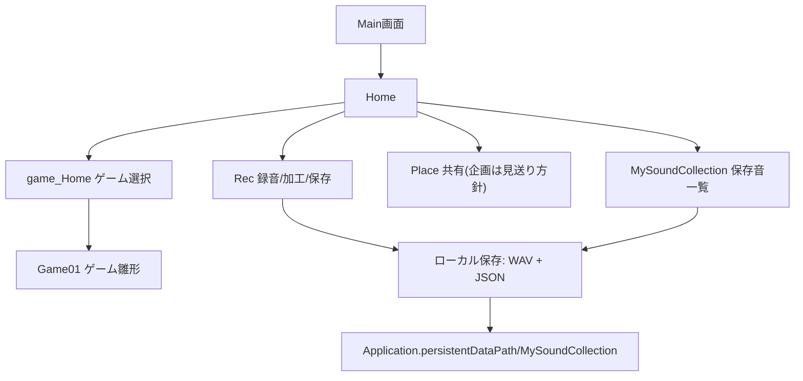
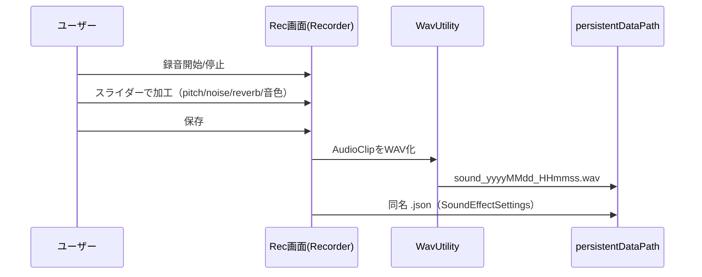

# System Architecture（概要把握レベル）

## System Overview

本アプリは Unity 6（6000.4.2f1, URP）製のスマホ/タブレット向け「音」体験アプリの**初期実装**。
シーン単位で画面を分割し、`SceneManager.LoadScene` によるシーン遷移でナビゲーションする構成。
主要機能として **録音＋音声加工**、**録音物のローカル保存（WAV＋JSON設定）**、**ゲーム一覧UI**、**週替わりテーマ表示** が実装済み。
バックエンド/サーバーは無く、データは端末ローカル（`Application.persistentDataPath`）に保存する完全オフライン構成。

## Scene Map（画面構成）

テキスト表現:

```
Main画面 (Main画面.unity)
  └─ Home (Home.unity)
       ├─ Rec (Rec.unity)                        録音・加工・保存
       ├─ MySoundCollection (MySoundCollection.unity)  保存音の一覧/読込
       ├─ Place (Place.unity)                    共有（企画上は初回見送り方針だが画面は存在）
       ├─ game_Home (game_Home.unity)            ゲーム選択（カテゴリ切替＋カード一覧）
       │    └─ Game01 (Game01.unity)             個別ゲーム（雛形）
       └─ weekly theme（Home上に WeeklyTextController で表示）
SampleScene / SampleScene（Scenes/）             Unity既定サンプル（未使用想定）
```

## Architecture Diagram



## Component Descriptions

### 録音・加工（Recording / Effects）
- **Purpose**: マイク録音、再生時の音声加工、加工結果のWAV保存
- **実装**: `RecorderWithEffects`（カスタムDSP: pitch/noise/timbre[Robot,Bitcrush]/reverb を `OnAudioFilterRead`＋オフラインレンダリングで実装）、`VoiceRecordingSection`（Unity標準AudioFilter: LowPass/HighPass/Reverb/Echo/Distortion＋pitch(cents)＋音色プリセットで実装）
- **注意**: 録音機能が**2実装併存**（設計方針の統一が必要）
- **Type**: Application

### 保存・データ（Storage）
- **Purpose**: 録音音の永続化と読込
- **実装**: `WavUtility`（16bit PCM WAVエンコード/デコード）、`SoundSavePaths`（保存先ディレクトリ管理）、`MySoundCollectionStorage`（WAV＋`SoundEffectSettings`のJSONを対で保存/読込）、`SoundEffectSettings`（加工パラメータのデータモデル）
- **Dependencies**: UnityEngine, System.IO, JsonUtility
- **Type**: Application / Model

### ゲーム選択UI（Game Selection）
- **Purpose**: カテゴリ別のゲームカード一覧表示
- **実装**: `GameCardListUI`（カテゴリ変更でカード再描画）、`CategorySelectorUI`（カテゴリ: kikiwake/narabekae/action/kumiawase）、`GameCardData`（title/category/difficulty/questionCount/selectSoundCount 等）、`GameCardUI`（カード表示）、`ScrollRectSnapLoop`（横スワイプのスナップ）
- **注意**: **ゲーム本体のロジックは未実装**（一覧・選択のみ、`Game01` は雛形）
- **Type**: Application

### 画面遷移（Navigation）
- **Purpose**: シーン間遷移
- **実装**: `SceneSwitcher`、`GoToRecButton`、`GoToPlaceButton`、`GoToMySoundLibraryButton`、`ReturnHomeButton`、`StartGameButton`
- **Type**: Application

### 週替わりテーマ（Weekly Theme）
- **Purpose**: 週ごとのお題テキスト表示
- **実装**: `WeeklyTextController`（オノマトペ13種を週番号で切替表示）
- **注意**: 企画では「お題→Recへ遷移」だが、現状は**テキスト表示のみ**（音・遷移は未実装）
- **Type**: Application

## Data Flow（録音→保存の主要フロー）



## Integration Points
- **External APIs**: なし（完全オフライン）
- **Databases**: なし（ファイルベース: WAV + JSON をローカル保存）
- **Third-party Services**: なし

## Infrastructure Components
- **デプロイ形態**: モバイルアプリ（Unity ビルド）。サーバー/クラウド無し。
- **保存先**: 端末ローカルストレージのみ。

## 補足
- 企画（プロジェクト概要.md）と実装の差分は `plan-vs-implementation-gap.md` を参照。
